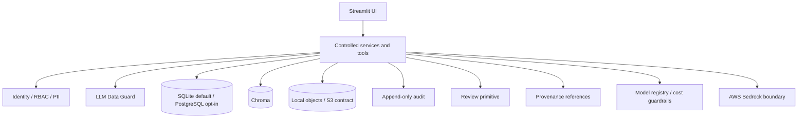

# Ada Phase 0 Architecture

This document records the platform and security boundaries implemented in Phase 0. The
broader target architecture and delivery sequence remain in
[`roadmap_v3.md`](roadmap_v3.md).

## Component boundary

Streamlit is presentation-only. Agents and pages never receive a raw SQL function or direct
database connection. Only platform and domain service code may use the database boundary.

## Local-first storage

- `ADA__DB_URL` defaults to SQLite; a `postgresql://` URL enables the optional Postgres
  adapter.
- Chroma persists under `ADA__CHROMA_PATH`.
- Original files and generated artifacts use `ObjectStore`; Phase 0 implements
  `LocalObjectStore`, while the S3 adapter remains a Phase 19 contract.
- File intake stores and registers uploads but does not parse them into domain records.

## Identity, authorization, and PII

Development identity comes from `ADA__DEV_USER` and `ADA__DEV_ROLE`. Application services
enforce a deterministic role × permission matrix for `viewer`, `editor`, `approver`, and
`admin`. Field filtering uses `public`, `internal`, and `sensitive` PII tiers. Application-user
OIDC is an interface hook until Phase 19.

Authorization answers whether a user may access a record. The LLM Data Guard separately
applies deny-by-default, purpose-specific `ALLOW`, `MASK`, `REDACT`, or `DENY` decisions so a
model receives only fields needed for its task.

## Agent and document safety

- Uploaded content is untrusted data, never instructions.
- `sanitize_untrusted()` removes control characters and neutralizes common embedded
  instruction phrases; `wrap_untrusted()` creates a data-only delimiter.
- Agents request capabilities rather than model IDs. The registry resolves capability ×
  budget tier to current Bedrock IDs and applies bounded token, loop, timeout, and retrieval
  settings.
- Required processing, authorization, provenance, audit, and high-impact review do not
  disappear in lower budget tiers.

## Review, provenance, and audit

`ReviewRequest` and `ApprovalDecision` provide a small persistent lifecycle that intake and
future high-impact writes can reference. `SourceRef`, `EvidenceRef`, and `ProvenanceRef` allow
ingestion to attach references before the complete Phase 7 evidence engine exists.

Audit events append to `<data_path>/audit/audit.jsonl` and include actor, action, entity,
before/after values, source, model/prompt context, confidence, and change-set identifiers.
Mutable domain records use soft deletion and versioning in later phases.

## Secrets, retention, and deletion

The default secrets backend reads environment variables. AWS Secrets Manager and SSM remain
adapter contracts for Phase 19. Secret values are never included in `AdaConfig.describe()`,
logs, or the UI.

For local development, the Administration page can launch the AWS CLI's SSO device flow.
The launcher binds Streamlit to localhost, streams only display-safe CLI output, and never
copies AWS tokens or credential-cache files into the repository. This helper is removed when
application-user OIDC replaces development identity.

> **Production blocker:** remove the `AWS Session (Local Only)` tab and
> `ada.platform.aws_auth` before enabling non-local access. Production authentication must
> use application-user OIDC and workload identity; it must never display AWS credential
> values.

Local reset requires explicit confirmation plus `admin` permission. It clears SQLite, Chroma,
and object storage, reinitializes platform tables, and records the operation. Production
retention, legal hold, backup, and KMS policies are hardened in Phase 19; the initial audit
retention target is at least one year.

## CI/CD boundary

Pull-request CI uses frozen dependencies and no AWS credentials. It runs formatting/lint,
typing, unit tests, dependency/secret scanning, documentation checks, and a guard against
tracked `data/`. Live Bedrock testing is manual and uses a protected GitHub Environment with
short-lived AWS OIDC credentials. Phase 19 builds, scans, signs, and promotes one immutable
container digest through dev, staging, and production with health-based rollback.

Temporary dependency exceptions and their compensating controls are listed in
[`security_exceptions.md`](security_exceptions.md); unlisted advisories remain blocking.
