# Ada - Architecture & Flow Diagrams

This is the single place that collects Ada's flowcharts with a short explanation of each.
Diagrams 1–8 also appear in [`roadmap_v3.md`](roadmap_v3.md) in context; diagrams 9–16 live
here and in any directly relevant phase document. The headline diagrams (1–2, simplified)
also appear in [`product.md`](product.md).

> **Living diagrams (subject to change).** These flowcharts reflect the *current* design
> intent and will be **updated/replaced** as the architecture is refined or as phases are
> implemented. If a diagram ever diverges from the code, treat the implementation and the
> per-phase docs (e.g. [`phase_0.md`](phase_0.md)) as the source of truth.

## Contents

1. [Target architecture](#1-target-architecture)
2. [Agentic / multi-agent architecture](#2-agentic--multi-agent-architecture)
3. [Model Router + budget tiers](#3-model-router--budget-tiers)
4. [AWS Bedrock connection](#4-aws-bedrock-connection)
5. [Streamlit UI -> Services -> DB](#5-streamlit-ui---services---db)
6. [Structured ingestion pipeline](#6-structured-ingestion-pipeline)
7. [MVP first-demo flow](#7-mvp-first-demo-flow)
8. [Development sequence](#8-development-sequence)
9. [Document storage & provenance](#9-document-storage--provenance)
10. [Policy resolution](#10-policy-resolution)
11. [Read / write safety (LLM Data Guard)](#11-read--write-safety-llm-data-guard)
12. [Organization hierarchy & roll-up](#12-organization-hierarchy--roll-up)
13. [Event-driven workflow](#13-event-driven-workflow)
14. [Policy lineage](#14-policy-lineage)
15. [Phase 0 component boundaries](#15-phase-0-component-boundaries)
16. [CI/CD delivery flow](#16-cicd-delivery-flow)

---

## 1. Target architecture

The end-to-end system. Streamlit is presentation-only; all logic lives behind the
**application/service layer**, which is the *only* layer allowed to touch the databases.
Agents interpret; **controlled domain tools**, the **LLM Data Guard**, and deterministic
services execute. The structured DB is the source of truth; the object store holds original
files; the vector DB holds policy/document chunks, embeddings, and evidence.

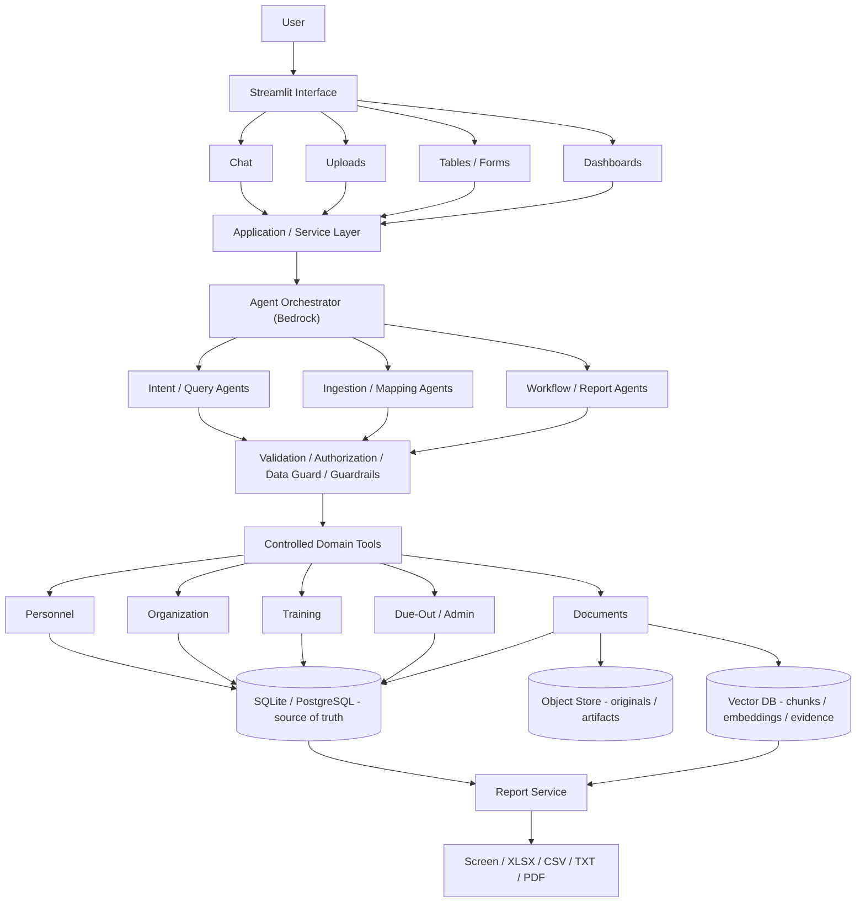

See roadmap Section 4.

---

## 2. Agentic / multi-agent architecture

How requests flow through agents. A **supervisor/orchestrator** routes to specialist
subgraphs (query, ingestion, due-out, report). The ingestion subgraph shows the
orchestrator-worker + evaluator-optimizer pattern. Every path passes through **guardrails**
and the **model router**, and **high-impact** actions pause at a **human-in-the-loop**
interrupt (LangGraph) before deterministic services commit + audit.

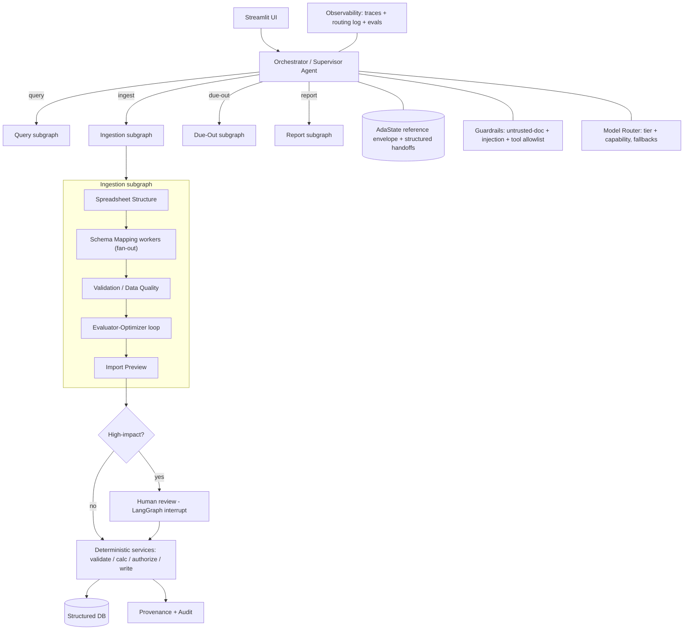

See roadmap Section 13. Framework: **Strands** (agents/tools) + **LangGraph** (durable,
checkpointed workflows).

---

## 3. Model Router + budget tiers

Ada is **multi-model**. A task class maps to a requested **capability**, and two orthogonal
levers pick the model for each call: that capability and the **budget tier** (High / Balanced
/ Economy). Each tier has a primary model and a fallback chain. Lower tiers are a cost/quality
lever, **not** a kill switch - the required pipeline always runs.

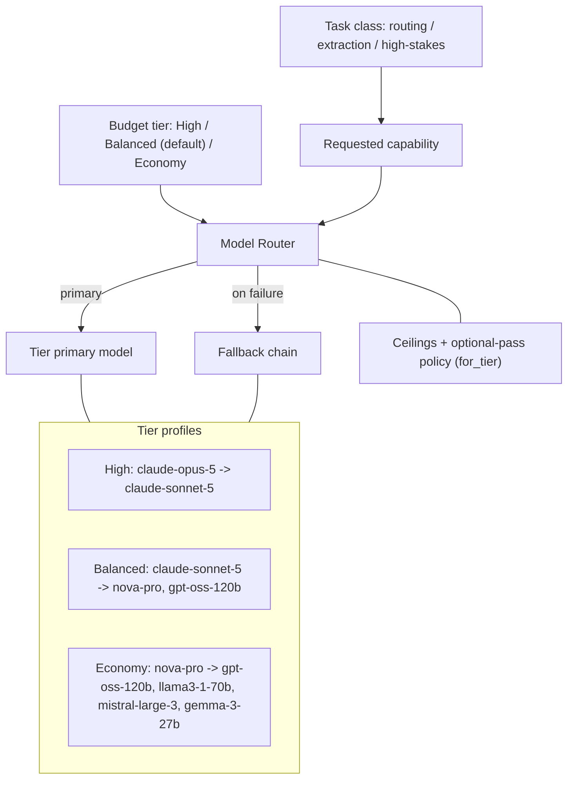

See roadmap Section 7.2. Embeddings stay fixed (`amazon.titan-embed-text-v2:0`).

---

## 4. AWS Bedrock connection

How Ada reaches Bedrock - the same `boto3` session pattern as IWB, driven entirely by
`AWS_PROFILE` / `AWS_REGION` through `AdaConfig`.

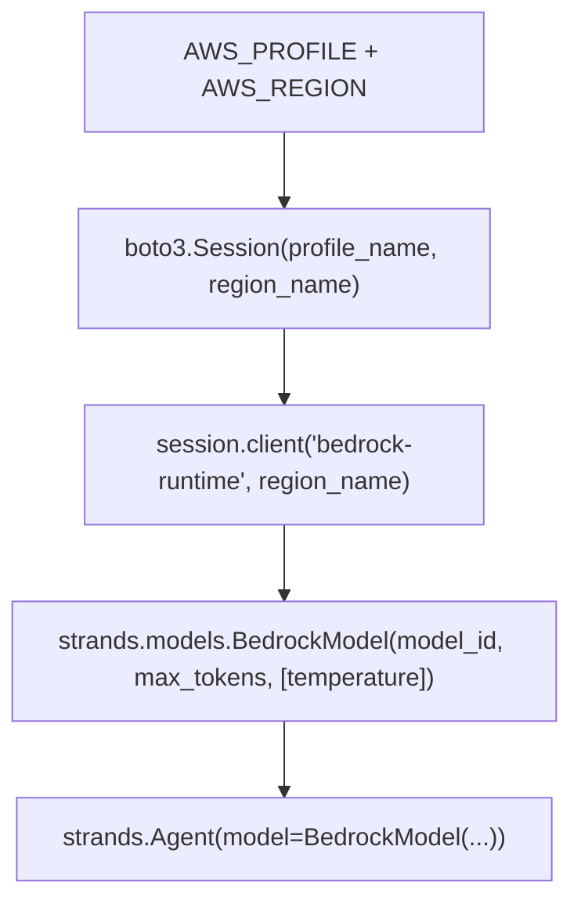

See roadmap Section 3.

---

## 5. Streamlit UI -> Services -> DB

The separation-of-concerns rule: the UI never holds business logic. It calls stable
**application services**, which own all database access. This keeps the platform replaceable
(e.g., swap Streamlit for React later) without touching the core.

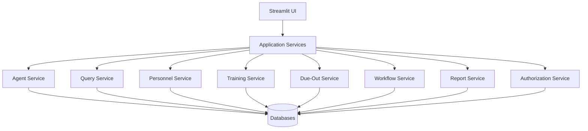

See roadmap Section 4.1.

---

## 6. Structured ingestion pipeline

The Phase 5 path for spreadsheets/CSV: parse, detect headers, map heterogeneous columns to
the canonical schema, validate, resolve entities, **preview**, then commit. Nothing is
written until the preview is approved.

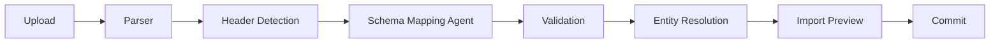

See roadmap Phase 5.

---

## 7. MVP first-demo flow

The headline demo: a messy operational workbook becomes structured records + due-outs, then
answers and a manager-ready report - in minutes.

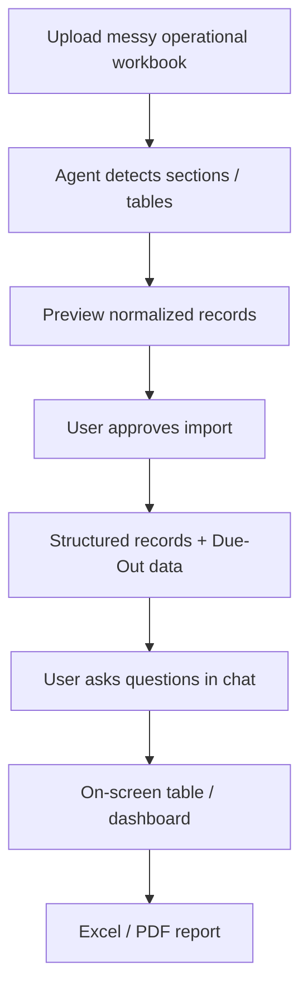

See roadmap Section 11.

---

## 8. Development sequence

The phase delivery order, grouped by stage. The MVP is Phases 0-11, including Phase 2A.

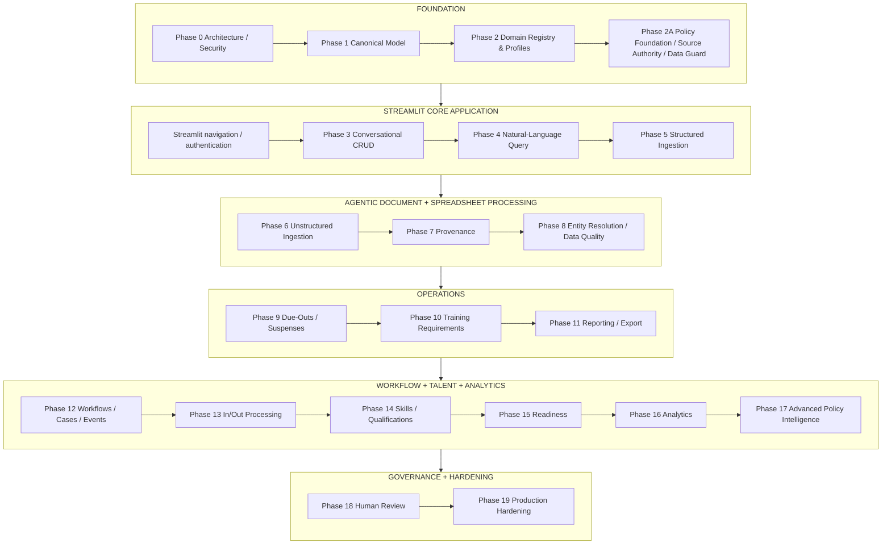

See roadmap Section 12.

---

## 9. Document storage & provenance

Documents are **not** stored "in the vector DB." The Document Service splits responsibilities:
SQL holds metadata/ACL/version, object storage holds the original file, and the vector DB holds
chunks/embeddings - all linked by `document_id`, with provenance spanning the three.

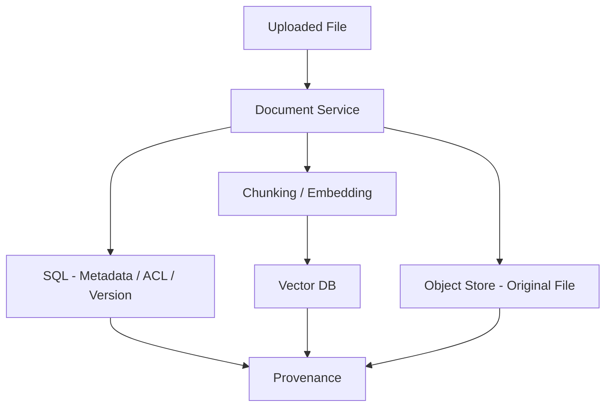

See roadmap Section 3 ("Local-first defaults") and Phases 0/7.

---

## 10. Policy resolution

Retrieving relevant policy is not the same as deciding which **approved rule** governs a task.
A request/event is classified, an agent narrows the policy family, and a **deterministic,
versioned** Policy Resolution Service returns the applicable approved rule set.

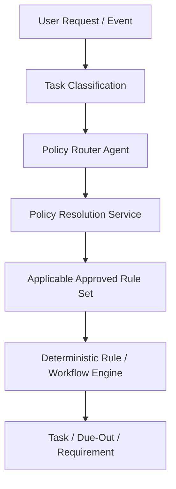

See roadmap Phase 2A.

---

## 11. Read / write safety (LLM Data Guard)

Writes flow through authorization, validation, and change-sets, pausing for human approval when
high-impact. Reads pass through the **LLM Data Guard** so only minimum-necessary fields ever
reach the model.

Write path:

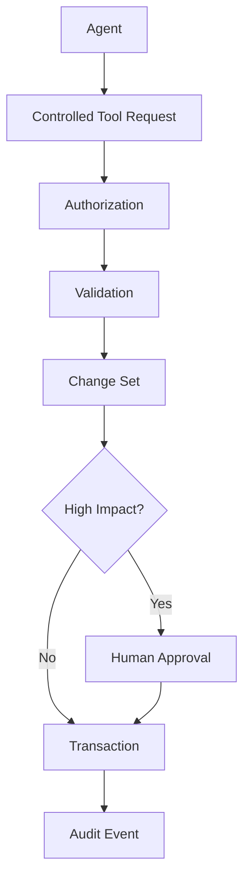

Read path:

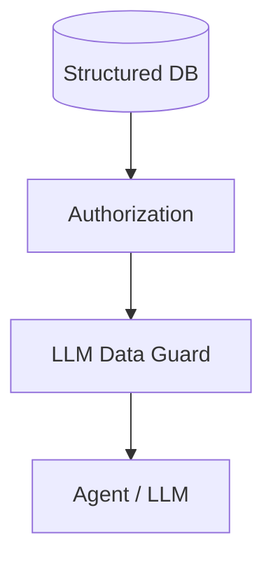

See roadmap 7.5 / 7.8 and Section 14.

---

## 12. Organization hierarchy & roll-up

A query against a parent org resolves descendant scope; roll-up services aggregate metrics up
the hierarchy, and configuration inherits BDE → BN → CO.

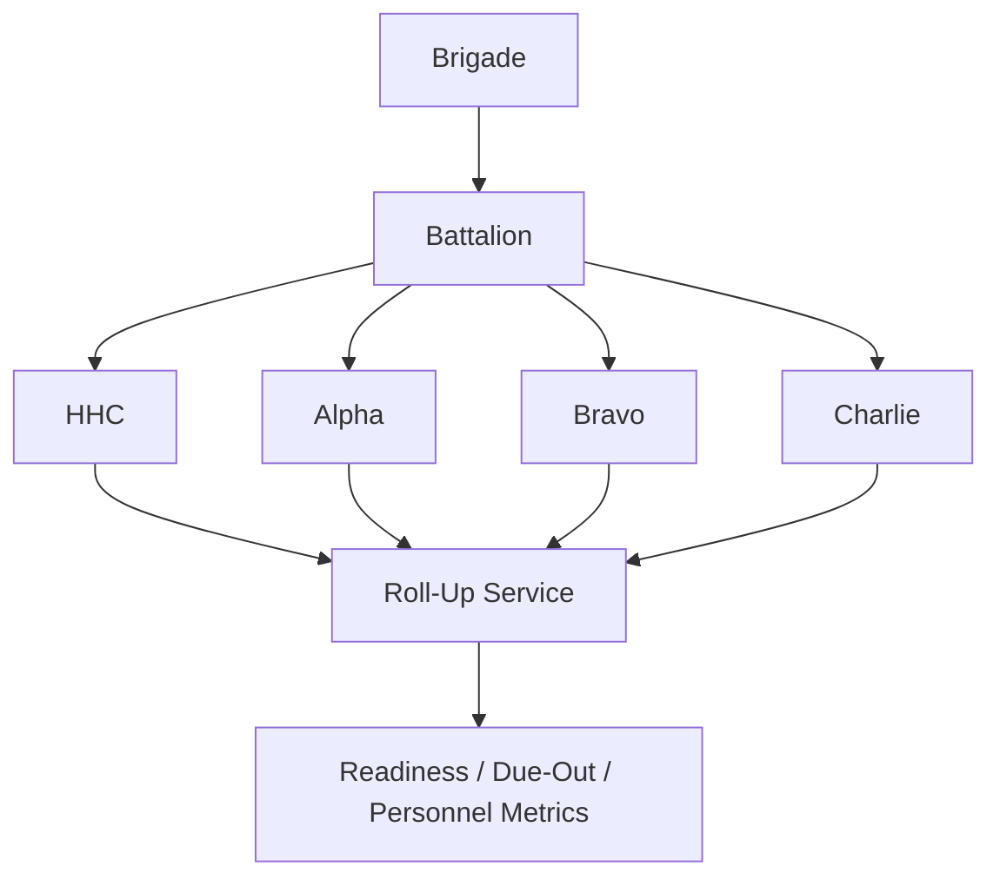

See roadmap Phase 1 (hierarchy/roll-up services).

---

## 13. Event-driven workflow

Domain changes emit events (via a transactional outbox) that a rule engine turns into
workflows, cases, tasks, and due-outs - surfacing in My Work, with no agent polling.

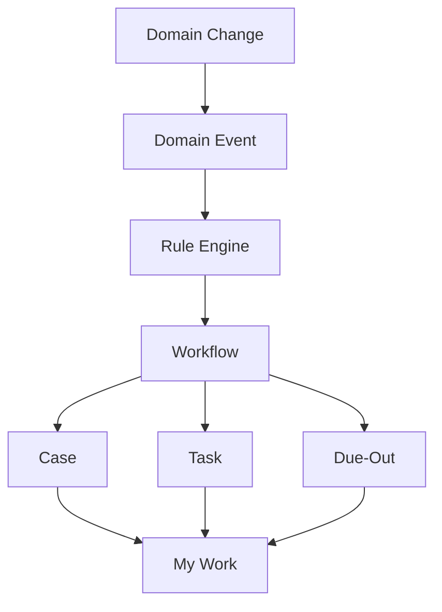

See roadmap Phase 12.

---

## 14. Policy lineage

Every operational item traces back to an approved rule and its governing policy - and forward
to the evidence that supports its status.

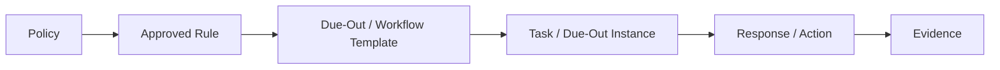

See roadmap Phase 2A / Phase 7.

---

## 15. Phase 0 component boundaries

The concrete foundation boundary delivered in Phase 0. The service/tool layer is the only
layer allowed to touch the database; platform controls and storage adapters remain separate,
testable modules.

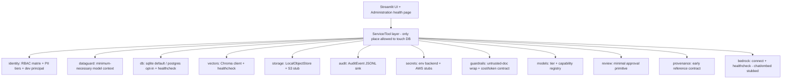

See [`phase_0.md`](phase_0.md), Section 4.

---

## 16. CI/CD delivery flow

Phase 0 establishes credential-free PR CI plus a manually authorized Bedrock integration
test. Phase 19 adds immutable, signed artifact promotion and production rollback.

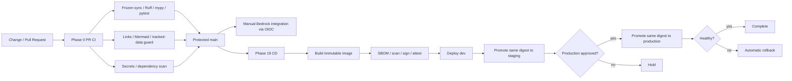

See roadmap Section 7.10 and [`phase_0.md`](phase_0.md), item 18.
