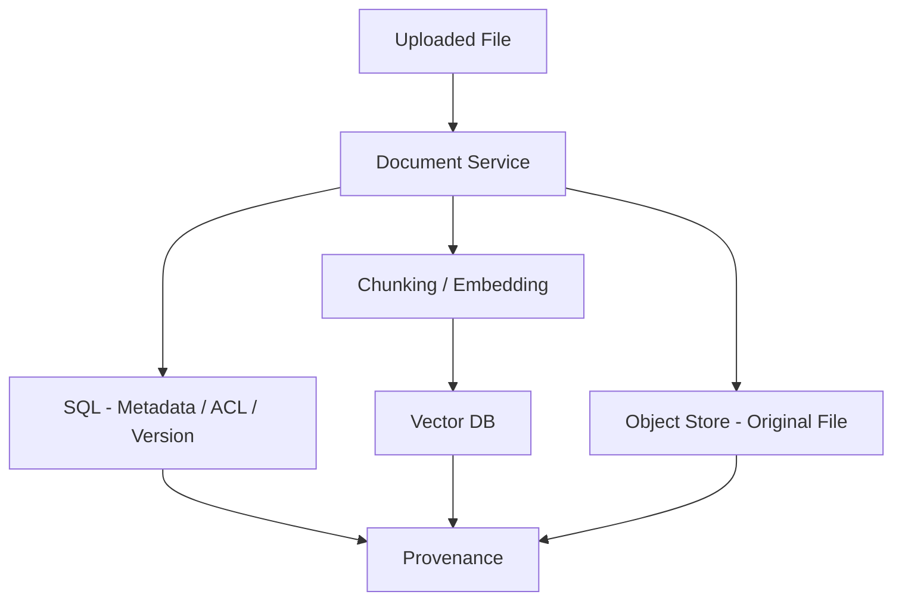
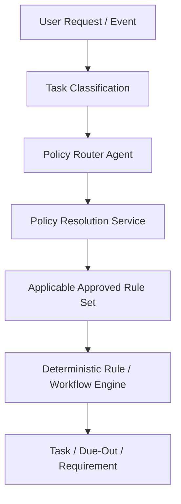
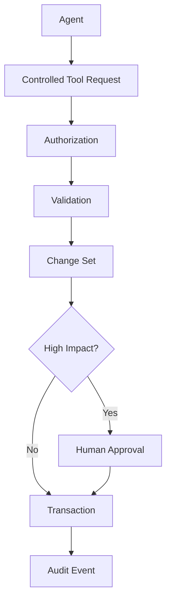
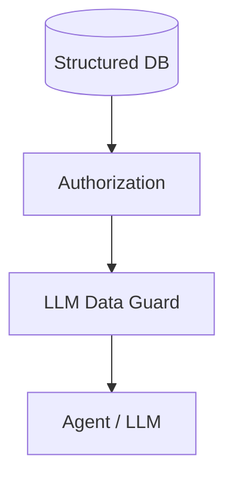
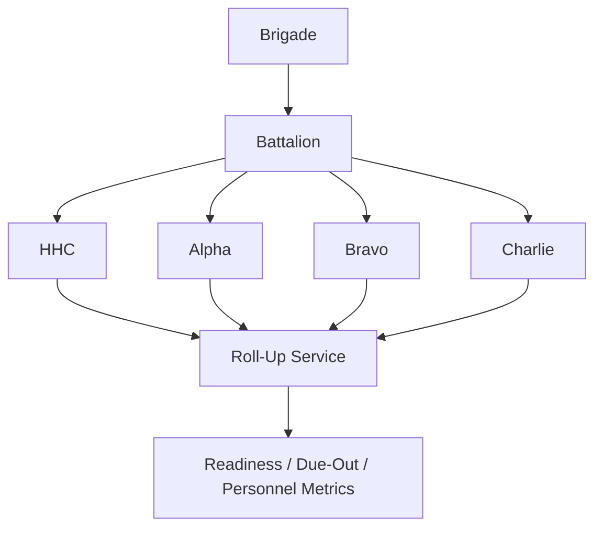
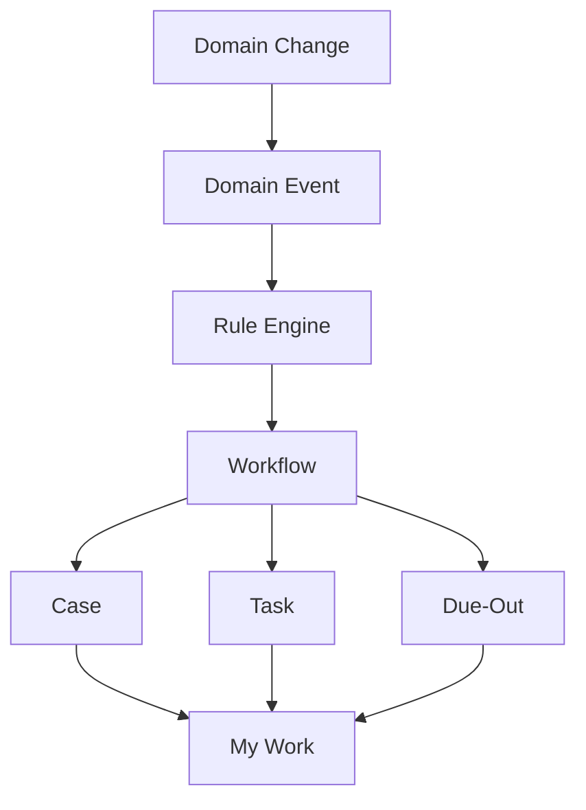
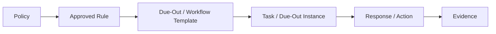

# Ada Roadmap v3 — Improvement Recommendations

> **Status: largely adopted into roadmap v3 and `phase_0.md`.** Phase 2A, the LLM Data
> Guard, minimal review primitive, early provenance-ref contract, capability-based model
> routing, AdaState reference envelope, organization roll-ups, source authority and
> reconciliation, `as_of` reporting, My Work, case management/domain events, and the connector
> framework have been incorporated. Retained for historical rationale; treat
> [`../roadmap_v3.md`](../roadmap_v3.md) and [`../phase_0.md`](../phase_0.md) as authoritative
> if anything conflicts.

> **Purpose:** This document originally captured recommended additions, corrections, and
> architectural improvements to `roadmap_v3.md` and `diagrams.md`. It is **not** a rewrite of
> the roadmap.

The current roadmap is already strong. These recommendations focus on gaps that are worth addressing before the architecture becomes difficult to change.

---

## 1. Preserve the Current Core Architecture

Keep the following design decisions:

- Streamlit as presentation layer only.
- Stable application/service layer between UI and core logic.
- Structured SQL/PostgreSQL as the source of truth.
- Vector DB for policy, semantic retrieval, documents, and supporting evidence.
- Controlled domain tools instead of unrestricted LLM-generated SQL.
- LLMs interpret ambiguity; deterministic services execute known rules.
- Human review for high-impact or ambiguous operations.
- Change-set preview/approval/rollback.
- Provenance and evidence tracking.
- Multi-model Bedrock routing.
- Agent evaluation and adversarial prompt-injection testing.
- Application profiles for military/general terminology.

---

## 2. Highest-Priority Improvement: Add an Early Policy Foundation

### Recommendation

Add:

```text
Phase 2A — Policy Registry, Source Authority, Rules & Defaults
```

before the core operational phases become deeply coupled to business logic.

### Why

Training, due-outs, administrative actions, readiness, and workflows eventually need to answer:

```text
Why is this required?
Which policy applies?
Which version is current?
Does this apply to this organization?
Does a local SOP modify the process?
What happens if no unit SOP exists?
Is this an official requirement or only a system default?
```

If this policy foundation is added too late, earlier workflow logic may need redesign.

### Phase 2A should establish

```text
PolicyDocument
PolicyRule
CandidateRule
PolicyGap
TaskPolicyLink
ApplicablePolicySet
SourceAuthority
RuleVersion
LocalDefault
```

Rule-source types:

```text
AUTHORITATIVE
DERIVED_APPROVED
LOCAL_DEFAULT
UNKNOWN
```

- **AUTHORITATIVE** — directly supported by an approved governing source.
- **DERIVED_APPROVED** — interpreted/extracted from authoritative text, then approved by an authorized human.
- **LOCAL_DEFAULT** — configurable behavior used only where official/local policy does not define the operational detail.
- **UNKNOWN** — insufficient approved information exists to determine applicability.

Important rule:

```text
"We normally do it this way."
```

must never become:

```text
"Army policy requires this."
```

without an approved supporting source.

---

## 3. Add a Policy Resolution Service

Do not allow an LLM to freely search documents and decide which policy governs a task each time.

Use:

```text
User Request / Domain Event
          ↓
Task Classification
          ↓
Policy Router Agent
          ↓
Policy Resolution Service
          ↓
Applicable Approved Rule Set
          ↓
Deterministic Rule / Workflow Engine
```

### Why

Policy applicability should be repeatable, versioned, auditable, organization-aware, date-aware, and consistent across users.

### Suggested entities

```text
TaskType
├── task_type_id
├── name
├── domain
├── risk_level
└── default_workflow
```

```text
TaskPolicyLink
├── task_type_id
├── policy_id
├── rule_id
├── organization_scope
├── applicability
├── effective_from
├── effective_to
└── priority
```

```text
ApplicablePolicySet
├── applicable_policy_set_id
├── task_type_id
├── organization_id
├── person_id
├── resolved_policy_ids[]
├── resolved_rule_ids[]
├── resolver_version
└── resolved_at
```

Important tasks should retain:

```text
task_id
task_type_id
applicable_policy_set_id
applied_rule_ids[]
policy_resolution_version
```

---

## 4. Add Explicit No-SOP Fallback Behavior

Ada should continue operating when a local unit SOP is unavailable.

```text
No Unit SOP
      ↓
Apply Approved Higher-Level Policy
      ↓
Use Approved Local/System Default
      ↓
Create PolicyGap
      ↓
Continue Operation
      ↓
Replace Default When SOP Becomes Available
```

### Add a Policy Gap Registry

```text
PolicyGap
├── gap_id
├── organization_id
├── domain
├── topic
├── description
├── current_fallback
├── fallback_source
├── risk_level
├── review_status
└── resolution
```

Useful queries:

```text
Which workflows are using defaults?
What unit policies are missing?
Which rules have no authoritative source?
Show unresolved policy gaps for 2 DSB.
```

---

## 5. Add Bounded Policy Agents

Agents should assist with ambiguity, not make the final compliance decision.

### Policy Router Agent

Determines the relevant task/policy family.

Example:

```text
"Smith is leaving in 60 days."

→ OUT_PROCESSING
→ ASSIGNMENT
→ EVALUATION
→ AWARD
→ ACCOUNT_CLOSURE
```

### Policy Applicability Agent

Interprets complex policy language and proposes structured applicability rules.

### Policy Conflict Agent

Finds:

- conflicting policy,
- local guidance that appears inconsistent with higher authority,
- superseded versions,
- overlapping rules,
- ambiguous organizational scope.

### Boundary

Do **not** create a final "Policy Decision Agent."

Use agents for ambiguity. Use deterministic services for approved rules.

---

## 6. Add a Real LLM Data Guard

Add an explicit layer between retrieved domain data and the LLM:

```text
Database
   ↓
Controlled Domain Tool
   ↓
Authorization
   ↓
LLM Data Guard
   ↓
Minimum-Necessary Dataset
   ↓
Agent / LLM
```

Possible decisions:

```text
ALLOW
MASK
REDACT
DENY
```

### Why

Authorization answers:

```text
Can this user access this record?
```

The Data Guard additionally answers:

```text
Does the model need this field to answer this question?
```

Example:

```text
Show P0054's overdue training.
```

The model may need:

```text
Name
Organization
Course
Completion
Expiration
Status
```

but not:

```text
SSN
DOB
Home Address
Personal Phone
Emergency Contact
```

Suggested metadata:

```text
FieldDefinition
├── entity
├── field
├── sensitivity
├── pii_category
├── llm_access
├── export_policy
├── mask_policy
└── audit_policy
```

---

## 7. Improve the Document Storage Architecture

Avoid the impression that documents live primarily in the vector DB.

Recommended architecture:

```text
                  Document Service
                /        |         \
               /         |          \
              ▼          ▼           ▼
      SQL Metadata    Object Store   Vector DB
                      (S3/local)

      document_id     original PDF   chunks
      version         XLSX/DOCX      embeddings
      permissions                    semantic index
      classification
      retention
      provenance
```

Use:

- **SQL** for metadata, permissions, versions, provenance, classification, retention.
- **S3/local object storage** for original files.
- **Vector DB** for chunks/embeddings.
- `document_id` to link everything.

---

## 8. Keep Vector Retrieval Out of Authoritative Report Values

Preferred reporting path:

```text
SQL
 ↓
Query / Analytics Service
 ↓
Verified Result Dataset
 ↓
Report Service
```

Policy/evidence retrieval is supplemental:

```text
Verified Result Dataset
          │
          └── Evidence Resolver → citations / explanation
```

### Why

The vector DB can support citations, policy explanations, evidence, and context. It should not provide authoritative report values.

---

## 9. Redefine AdaState as a Workflow Envelope

The current conceptual state includes arrays of people, training records, due-outs, etc. That will not scale well.

Recommended:

```text
AdaState
├── request_id
├── conversation_id
├── user_context
├── intent
├── task_type
├── organization_scope[]
├── selected_entity_refs[]
├── query_plan
├── result_ref
├── document_refs[]
├── evidence_refs[]
├── applicable_rule_refs[]
├── validation_issues[]
├── unresolved_questions[]
├── change_set_id
├── approval_id
└── workflow_status
```

### Why

This keeps workflow checkpoints small, avoids duplicating database state, reduces accidental PII exposure, and supports larger organizations.

The actual records stay in SQL.

---

## 10. Clarify the Strands vs. LangGraph Boundary

Use this responsibility split:

```text
STRANDS
-------
Reasoning
Agent specialization
Tool selection
Extraction
Interpretation

LANGGRAPH
---------
Durable process state
Workflow transitions
Pause / Resume
Human approval
Retries
Checkpoints
Long-running business workflows
```

Preferred pattern:

```text
LangGraph Workflow
       ↓
Strands Agent Node
       ↓
Structured Result
       ↓
LangGraph Deterministic Node
```

### Why

Without a strict boundary, the project risks duplicated routing, nested state machines, hard-to-debug retries, and unclear checkpoint ownership.

---

## 11. Fix the Phase 6 ↔ Phase 7 Dependency Cycle

### Recommendation

Split provenance into two levels.

#### Early provenance contract — Phase 0/1

Define:

```text
SourceRef
EvidenceRef
ProvenanceRef
```

Ingestion can write these references from the beginning.

#### Full Evidence Engine — Phase 7

Add:

```text
source rendering
document navigation
confidence display
cross-record evidence
lineage UI
evidence comparison
```

### Why

This removes the circular dependency while preserving provenance from the start.

---

## 12. Move a Minimal Human-Review Primitive Earlier

Create a minimal review primitive in Phase 0/3:

```text
ReviewRequest
ApprovalDecision
Reviewer
Reason
CreatedAt
ResolvedAt
```

Support:

```text
APPROVE
REJECT
RETURN_FOR_CORRECTION
```

Then keep Phase 18 for an advanced review center:

```text
delegated approval
multi-reviewer workflows
policy review
merge review
bulk review
approval routing
escalation
review SLA
```

### Why

Early ingestion and high-impact operations already depend on approval.

---

## 13. Add Source Authority and a Reconciliation Center

Conflict detection alone is not enough. Ada should know which source is normally authoritative.

```text
Source
├── source_id
├── name
├── source_type
├── domain
├── authority_level
├── system_of_record
├── organization_scope
├── effective_date
└── active
```

Authority may also be field-specific:

```text
SourceAuthorityPolicy
├── entity
├── field
├── preferred_source
├── fallback_source
└── conflict_behavior
```

Example:

```text
Assignment.departure_date
→ official personnel system

TrainingRecord.completion_date
→ training system

Personal contact
→ approved local roster

Uploaded memo
→ supporting evidence

User entry
→ provisional unless approved
```

### Add a Streamlit Reconciliation Center

```text
Person: P0054
Field: Estimated Departure

Personnel Master:  15 OCT 2026
Uploaded Memo:     10 NOV 2026

Recommended:
Keep Personnel Master value

[Accept] [Override] [Investigate]
```

---

## 14. Add an Organization Hierarchy / Roll-Up Service

Add:

```text
OrganizationHierarchyService
OrganizationScopeService
RollupService
```

Example:

```text
User asks:
"Show 2 DSB."

Resolved scope:

2 DSB
├── 2 DSB HHC
├── 2 DSB A CO
├── 2 DSB B CO
└── 2 DSB C CO
```

Use the same scope for:

```text
personnel strength
training readiness
due-outs
administrative actions
departures
staffing
readiness
```

Also support inheritance:

```text
Brigade configuration
       ↓
Battalion override
       ↓
Company override
```

Useful for policy scope, due-out templates, reporting requirements, escalation thresholds, and training requirements.

---

## 15. Add Point-in-Time / As-Of Reporting

Make `as_of` a first-class reporting/query concept.

Example:

```text
What was 2 DSB training readiness at the August reporting cycle?
```

must not be recalculated using today's state.

Support either:

```text
effective-dated historical queries
```

or:

```text
ReportSnapshot
├── snapshot_id
├── reporting_cycle_id
├── as_of
├── dataset_ref
├── generated_at
└── source_versions[]
```

### Why

Operational reports need historical reproducibility.

---

## 16. Add "My Work" as a Primary User Experience

Add:

```text
My Work
```

near the top of the Streamlit navigation.

Suggested navigation:

```text
Ada
├── Home
├── My Work
├── AI Assistant
├── Personnel
├── Organization / Assignments
├── Training
├── Due-Outs
├── Administrative Actions
├── File Import / Review
├── Reports
├── Data Quality
└── Administration
```

`My Work` should combine:

```text
Due-outs
Administrative tasks
Approvals
Policy reviews
Data-quality issues
Upcoming deadlines
Escalations
Blocked tasks
```

### Why

The strongest daily-use question is often:

```text
What do I need to do today?
```

---

## 17. Add Case Management

Add a `Case` concept in or near the Administrative Workflow phase.

Example:

```text
Case: P0054 Out-Processing
│
├── Closeout Evaluation
├── Award
├── Account Termination
├── Equipment Turn-In
├── Personnel Action
├── Documents
├── Due-Outs
├── Blockers
└── Timeline
```

Suggested entities:

```text
Case
CaseParticipant
CaseTask
CaseDocument
CaseEvent
```

### Why

Without a case concept, one real-world personnel action can become fragmented across multiple tables.

---

## 18. Make Domain Events Explicit

Introduce events such as:

```text
PersonCreated
PersonArrived
PersonTransferred
DepartureApproaching
TrainingDueSoon
TrainingExpired
DueOutOverdue
PolicyUpdated
DocumentIngested
```

Architecture:

```text
Domain Event
    ↓
Rule Engine
    ↓
Workflow
    ↓
Case / Task / Due-Out
    ↓
My Work
```

Use a transactional **outbox/event pattern** for reliability.

### Why

This supports automation without requiring agents to continuously poll the database.

---

## 19. Add a Connector Framework

Keep file upload for the MVP, but define an external-source interface now.

```text
SourceConnector
├── connector_id
├── source_system
├── domain
├── authority
├── mapping
├── sync_strategy
├── organization_scope
├── last_sync
└── status
```

Future examples:

```text
HR system
Training system
SharePoint
S3
Database
REST API
```

Flow:

```text
External Source
      ↓
Connector
      ↓
Staging
      ↓
Mapping
      ↓
Validation
      ↓
Reconciliation
      ↓
Structured DB
```

### Why

This prevents the architecture from becoming permanently dependent on manual file uploads.

---

## 20. Keep Agent Use Focused on Ambiguity

Project-wide rule:

> **Use agents where language or document structure is ambiguous. Use deterministic code where the rule is known.**

Good agent candidates:

```text
Intent Classification
Spreadsheet Structure
Schema Mapping
Unstructured Extraction
Entity Resolution Assistance
Due-Out Free-Text Interpretation
Policy Routing
Policy Applicability
Policy Conflict Detection
Report Narrative
```

Keep these deterministic:

```text
Authorization
Policy Resolution
Compliance Status
Overdue Calculation
Readiness Calculation
Database Writes
Workflow State Transition
Report Dataset Generation
Organization Roll-Up
Retention Enforcement
```

---

## 21. Reduce Model-Name Coupling in the Model Router

Keep model tiers, but route primarily by capability:

```text
FAST_ROUTING
STRUCTURED_EXTRACTION
COMPLEX_REASONING
MULTIMODAL
HIGH_STAKES_REVIEW
```

Then configuration maps capabilities to current Bedrock models:

```text
FAST_ROUTING → model A
COMPLEX_REASONING → model B
MULTIMODAL → model C
```

Budget tier still influences the mapping.

### Why

Model availability and naming will change faster than the architecture.

---

## 22. Additional Diagrams Recommended

### A. Document Storage & Provenance



### B. Policy Resolution



### C. Read / Write Safety



Read side:



### D. Organization Hierarchy & Roll-Up



### E. Event-Driven Workflow



### F. Policy Lineage



---

## 23. Recommended Roadmap Adjustment

Do not rewrite the current 0–19 structure.

Recommended evolution:

```text
FOUNDATION
0    Architecture / Security
1    Canonical Domain Model
2    Domain Registry / Profiles
2A   Policy Foundation / Source Authority / Data Guard

CORE
3    Conversational CRUD
4    Natural-Language Query
5    Structured Ingestion
6    Unstructured Ingestion
7    Provenance / Evidence
8    Entity Resolution / Reconciliation

OPERATIONS
9    Due-Outs / My Work
10   Training Requirement Engine
11   Reporting / Point-in-Time

WORKFLOW
12   Workflow + Case Management + Events
13   In/Out Processing

EXPANSION
14   Skills / Qualifications
15   Readiness
16   Analytics
17   Advanced Policy Intelligence / Change Impact

GOVERNANCE
18   Advanced Human Review
19   Production Hardening
```

---

## 24. Implementation Priority

### Design / implement now

1. Policy Foundation / Phase 2A.
2. Source Authority model.
3. LLM Data Guard.
4. AdaState as references rather than full domain datasets.
5. Strands/LangGraph responsibility boundary.
6. Early review primitive.
7. Provenance-interface dependency fix.
8. Organization hierarchy/roll-up service.
9. Document metadata + object storage + vector separation.

### Add during the MVP

1. My Work queue.
2. Reconciliation Center.
3. Point-in-time reporting semantics.
4. Basic policy-gap visibility.
5. Policy provenance attached to requirements/due-outs.

### Add after the MVP core is stable

1. Case management.
2. Event-driven workflows.
3. External connector framework.
4. Advanced policy comparison/change impact.
5. Complex policy conflict/applicability agents.
6. Advanced review routing/delegation.

---

## 25. Final Recommendation

Do **not** rewrite the current roadmap from scratch.

The strongest evolution is to make Ada:

```text
Policy-aware
Source-aware
Hierarchy-aware
Historically reproducible
Operationally task-centered
```

A strong long-term architecture is:

```text
People / Organizations / Training / Admin
                  │
                  ▼
          Cases / Tasks / Due-Outs
                  │
        ┌─────────┼─────────┐
        ▼         ▼         ▼
     Policies  Workflows  Evidence
        │         │         │
        └─────────┼─────────┘
                  ▼
          Deterministic Rules
                  │
                  ▼
              My Work
                  │
                  ▼
         Streamlit + AI Assistant
```

This keeps the **work HR must accomplish** at the center of Ada, while agents, RAG, policies, databases, and automation support that work rather than becoming the product themselves.
