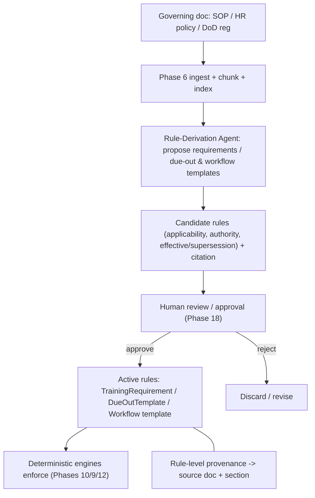

# New Idea - Policy-Driven Rules & Workflows (SOP / HR / DoD document ingestion)

> **Status: partially incorporated into roadmap v3.** Phase 2A now establishes the policy,
> source-authority, candidate-rule, and policy-gap foundation. This document retains the
> proposed automated rule/workflow-derivation extension across Phases 6/10/12/17/18.

## Goal

Let Ada use **authoritative documents** - SOPs, HR policies, and DoD/Army regulations
(ARs, DA PAMs, memoranda) - to **actively guide the HR process**, not just answer questions
about it. Ingesting a governing document should be able to **propose the structured rules,
requirements, and workflow templates** that the deterministic engines then enforce, always
through human review and with a citation back to the source.

## What we already have (this builds on it)

- **Vector DB for policy/SOP chunks** and semantic/evidence retrieval (roadmap Section 3).
- **Phase 2A - Policy Foundation:** versioned policy/rule/source models, source authority,
  `CandidateRule`, `DERIVED_APPROVED`, and deterministic policy resolution.
- **Phase 6 - Unstructured Ingestion:** classify + extract + chunk + index policy/SOP/memoranda.
- **Phase 17 - Advanced Policy Intelligence:** policy comparison, conflict/supersession
  detection, change-impact analysis, and grounded answers with citations.
- **Phase 10 - Training Requirement Engine:** rules already carry `authority`,
  `supersedes_requirement`, effective/expiration dates.
- **Phase 7 provenance**, **Phase 18 human review**.

The policy model and reading/grounding are scheduled. The net-new value below is the
automated proposal **write path**:
authoritative doc -> *derived* rules/workflows.

## The core loop (proposed)

> Diagram is **living** and will change as this is refined.

## Concepts to add

1. **Governing-document library** - a first-class, *versioned* set of authoritative references
   (authority, effective date, supersession chain), distinct from ordinary uploaded documents.
   Every derived rule links back to its source document + section (rule-level provenance).
2. **Policy -> structured rule derivation** - a Rule-Derivation Agent proposes
   `TrainingRequirement`s, `DueOutTemplate`s, and applicability (by org/position/grade/role)
   from the doc; deterministic code + human review finalize. Never auto-activate.
3. **SOP -> workflow / checklist derivation** - e.g. an out-processing SOP becomes a proposed
   out-processing checklist / due-out template (feeds Phases 9/12/13).
4. **Profile knowledge packs** - ship a profile (e.g. military/DoD) with a curated governing-
   reference set, via the Phase 2 profile mechanism.

## Phase mapping

- **Phase 0** - reusable minimal review and provenance-ref contracts.
- **Phase 2** - profile knowledge packs (curated reference sets per profile).
- **Phase 2A** - policy/rule/source-authority foundation, candidate lifecycle, and deterministic
  resolution.
- **Phase 6** - ingest + classify governing docs into the library.
- **Phase 7** - rule-level provenance (rule -> source section).
- **Phase 10** - requirements derived from policy feed the Training Requirement Engine.
- **Phase 12/13** - SOP-derived workflow/checklist templates.
- **Phase 17** - extend Advanced Policy Intelligence with an automated **rule-derivation**
  proposal path.
- **Phase 18** - human review/approval gate before any derived rule is activated.

## Guardrails / risks

- Governing docs are still **untrusted input** (7.1): derivation may **never** auto-write or
  auto-activate rules - proposals only, behind human review.
- **LLMs interpret; deterministic code enforces** (4.2): the LLM proposes rules; final
  compliance/status is always computed deterministically.
- **Citations required**: every proposed rule must cite its source doc + section.
- **DoD/AR parsing is hard** (long, cross-referencing, superseding docs) - scope carefully;
  start with simple, single-requirement SOPs before large regulations.

## Open questions

- How much structure to require in the governing-document library vs. free-form RAG?
- Do derived rules need their own approval workflow separate from record change-sets?
- Which profiles ship with reference packs, and who curates/updates them?
