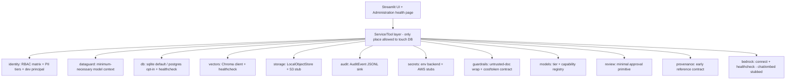

# Ada - Phase 0: Architecture and Security Foundation

> This document describes **Phase 0** of the Ada roadmap. It supplements
> [`roadmap_v3.md`](roadmap_v3.md) (see the Phase 0 section) with the concrete,
> agreed-upon plan for the foundation build.

> **Living diagrams (subject to change).** The flowcharts here reflect current design intent
> and will be **updated/replaced** as the architecture is refined or implemented. If a diagram
> diverges from the code, the implementation is the source of truth.

## 1. Goal

Establish Ada's architecture and security boundaries **before** processing any real data.
Phase 0 delivers working foundations and boundaries only - no domain CRUD, no structured
ingestion/parsing into records, and no live assistant product. (A file-intake *subset* that
only stores + registers uploaded files, without parsing, is in scope - see item 16.)

## 2. Scope and non-goals

- **In scope:** configuration, database/vector/object-storage boundaries, dev
  authentication + RBAC, PII model, audit and secrets sinks, untrusted-document and
  guardrail/cost contracts, a model-tier/budget-mode config + contract + toggle (with
  capability-based routing), an **LLM Data Guard**, a **minimal review primitive**, an early
  **provenance-ref contract**, a health-check Administration page, a small seed fixture, a
  file-intake subset (store + register, no parsing), a local reset utility, architecture docs,
  and the **CI/software-supply-chain baseline** from roadmap 7.10.
- **Out of scope (later phases):** domain schemas and CRUD (Phase 1), the domain registry
  and full application profiles (Phase 2), conversational features and live chat/embeddings
  (Phase 3+/6), structured file parsing/mapping into records (Phase 5), and production
  hardening / application-user OIDC (Phase 19). GitHub Actions uses AWS OIDC only for the
  manually dispatched Bedrock integration test.

## 3. Locked decisions

- **Database:** SQLite local-first default via `ADA__DB_URL`
  (default `sqlite:///<data_path>/ada.db`); PostgreSQL is opt-in by setting a
  `postgresql://` URL (uses the existing `[postgres]` `psycopg` extra). No SQLAlchemy -
  Ada mirrors IWB's stdlib/Protocol convention to stay dependency-light.
- **Auth:** dev authentication (switchable current user/role via env) plus a real RBAC
  matrix, PII tiers, and deterministic `authorize()`. OIDC is left as an interface hook
  for Phase 19.
- **Architecture seams folded in (from the v3 improvement review):** an **LLM Data Guard**
  (minimum-necessary fields to the model, 7.8), a **minimal review primitive**, the early
  **provenance-ref contract** (fixes Phase 6<->7), **capability-based model routing**, and
  `AdaState` as a **reference envelope**. See
  [`new_ideas/ada_roadmap_v3_improvement_recommendations.md`](new_ideas/ada_roadmap_v3_improvement_recommendations.md).
- **Multi-model + budget tiers:** a `ModelRegistry` + Model Router with **3 tiers**
  (`high`|`balanced`|`economy`, default `balanced`) and a
  **task-class-to-capability map**. Tier profiles
  (primary -> fallback chain): **High** = `claude-opus-5` -> `claude-sonnet-5` (optional passes
  on); **Balanced** = `claude-sonnet-5` -> `nova-pro`, `gpt-oss-120b` (evaluator on/debate
  off); **Economy** = `nova-pro` -> `gpt-oss-120b`, `llama3-1-70b`, `mistral-large-3`,
  `gemma-3-27b` (optional passes off). Task classes map first to capabilities:
  routing/classification -> `FAST_ROUTING`; extraction/mapping -> `STRUCTURED_EXTRACTION`;
  reasoning -> `COMPLEX_REASONING`; high-stakes -> `HIGH_STAKES_REVIEW` (with critique enabled
  in `high`). Each capability then resolves through the selected tier's capability map. Lower
  tiers are a cost/quality lever, **not** a kill switch. Phase 0 defines the registry +
  contract + Admin toggle; the Model Router consumes them in Phase 3+.
- **Scope depth:** ship **functional local adapters** so the exit criteria ("structured DB,
  vector DB, and object storage available") are literally met. Bedrock `chat`/`embed` remain
  stubs (Phase 3/6); Bedrock connectivity is already verified live.
- **Scope boundary:** Phase 0 includes only the small seed/smoke fixture (Section 6, item 15)
  to validate boundaries. The **fake-input-data generator + field crosswalk** (test data
  mimicking user input files, e.g. the due-out file), structured parsing / normalized ground
  truth, and the domain write-path/chat assets stay **deferred** (Section 7).
- **Demo data is synthetic:** the `data/demo/` set is fake (900-series SSNs, `example.test`
  emails), so the Phase 0 seed (copied into the tracked `samples/`) can reuse a slice freely.
- **Repo hygiene (to do before any `git add`):** **gitignore the entire `data/` directory**
  (real + synthetic stay local-only). `data/` has never been committed, so a `.gitignore`
  rule suffices - no history rewrite. The remote is **public**. Tracked sample fixtures live
  outside `data/`, under `samples/`.
- **CI/CD:** Phase 0 adds PR CI and a manual Bedrock integration workflow. PR CI has no AWS
  credentials and requires a frozen `uv` sync, Ruff, mypy, non-integration pytest, dependency/
  secret scanning, docs/Mermaid validation, and a tracked-`data/` guard. Bedrock integration
  uses a protected GitHub Environment + short-lived AWS OIDC role. Branch protection requires
  CI before merge. Production CD is deferred to Phase 19, targeting ECS/Fargate by default
  with immutable signed images promoted through dev/staging/production.

## 4. Component boundaries

Also collected as [Diagram 15 in `diagrams.md`](diagrams.md#15-phase-0-component-boundaries).

**Key rule (no unrestricted SQL):** only the service/tool layer may touch the database
boundary. Agents never receive a raw-SQL surface; they call controlled tools/services.

## 5. Current state

- **Already real:** [`src/ada/config.py`](../src/ada/config.py),
  [`src/ada/bedrock.py`](../src/ada/bedrock.py) `connect()`, and the Streamlit shell
  ([`app/streamlit_app.py`](../app/streamlit_app.py)) plus placeholder pages.
- **Stubs to replace:** [`src/ada/platform/identity.py`](../src/ada/platform/identity.py),
  [`src/ada/platform/audit.py`](../src/ada/platform/audit.py),
  [`src/ada/platform/secrets.py`](../src/ada/platform/secrets.py),
  [`src/ada/platform/storage.py`](../src/ada/platform/storage.py),
  [`src/ada/registry/profiles.py`](../src/ada/registry/profiles.py).
- **Not present yet:** DB access layer, vector-DB boundary, PII/RBAC and Data Guard models,
  review/provenance-ref/model-registry contracts, untrusted-document/guardrail helpers,
  architecture doc.

## 6. Work items

1. **Config + env** (`src/ada/config.py`, `example.env`, `.env`): add `db_url`,
   `secrets_backend`, `dev_user`, `dev_role`, guardrail knobs (`max_agent_loops`,
   `request_timeout_seconds`), and **model-tier** fields (`model_tier` default `balanced`;
   per-tier allowlists `ADA__MODELS_HIGH/BALANCED/ECONOMY`; per-tier ceilings) with
   `active_tier`/`active_chat_model` helpers; extend `describe()` (incl. active tier + primary).
2. **DB access layer** - new `src/ada/platform/db.py`: URL-scheme dispatch
   (`sqlite:///` -> stdlib `sqlite3`; `postgresql://` -> lazy `psycopg`), `get_connection()`,
   `healthcheck()` (`SELECT 1`), and idempotent `init_db()` creating a `schema_version`
   bookkeeping table, the minimal review tables from item 7A, and the `documents` intake table
   from item 16 (domain tables are Phase 1).
3. **Vector DB boundary** - new `src/ada/platform/vectors.py`: `chromadb.PersistentClient`
   at `config.chroma_path`, `get_or_create_collection(config.chroma_collection)`,
   `healthcheck()`. No embedding function yet (wired in Phase 6).
4. **Object storage** (`src/ada/platform/storage.py`): `ObjectStore` Protocol
   (`put/get/delete/exists/url`), concrete `LocalObjectStore` (atomic writes,
   path-traversal-safe keys), `S3ObjectStore` stub, and `get_object_store(config)` factory.
5. **Secrets** (`src/ada/platform/secrets.py`): `env` backend (default), with
   `aws-secrets-manager` and `ssm` interface stubs, chosen by `config.secrets_backend`.
6. **Identity / RBAC / PII + LLM Data Guard** (`src/ada/platform/identity.py`,
   `src/ada/platform/dataguard.py`): `Role`, `Permission`, `ROLE_PERMISSIONS` matrix,
   `PIITier`, deterministic `authorize(role, permission)`, `Principal` +
   `current_principal(config)`, field redaction, OIDC hook stub. Plus the **LLM Data Guard**
   (7.8): minimum-necessary field gating (`ALLOW/MASK/REDACT/DENY`) + `FieldDefinition`
   metadata, so only the fields a task needs reach the model.
7. **Audit** (`src/ada/platform/audit.py`): `AuditEvent` dataclass (Section 15 fields) and
   an append-only JSONL sink (`record_event`/`read_events`).
7A. **Review primitive + provenance-ref contract** (`src/ada/platform/review.py`,
    `src/ada/provenance/refs.py`): minimal `ReviewRequest`/`ApprovalDecision`
    (`APPROVE/REJECT/RETURN_FOR_CORRECTION`) that intake can reference and later high-impact
    writes can reuse, persisted in small platform-owned review tables; and an early
    `SourceRef`/`EvidenceRef`/`ProvenanceRef` contract so ingestion writes provenance from day
    one (breaks the Phase 6<->7 cycle). `AdaState` is documented as a **reference envelope**
    (module lands in Phase 1).
8. **Guardrails + model registry** - new `src/ada/platform/guardrails.py` +
   `src/ada/models/registry.py`: a `ModelRegistry` with 3 tier profiles (high/balanced/economy
    + fallback chains), a task-class-to-capability map, and a **capability map** (`FAST_ROUTING`/
   `STRUCTURED_EXTRACTION`/`COMPLEX_REASONING`/`MULTIMODAL`/`HIGH_STAKES_REVIEW` -> model per
   tier, so agents don't hard-code model names); `CostGuardrails.for_tier(config, tier)` +
   `capability_for(task_class)` and `model_for(tier, capability)` resolve model + ceilings +
   optional-pass flags (lower tiers still run all required steps); plus `wrap_untrusted()` /
   `sanitize_untrusted()` (7.1).
9. **Bedrock boundary** (`src/ada/bedrock.py`): add `healthcheck()` (connect + minimal
   `converse` ping); keep `chat`/`embed` as Phase 3/6 stubs.
10. **Profile stub** (`src/ada/registry/profiles.py`): `load_profile()` returns a minimal
    `military`/`general` bundle resolved from `ADA__PROFILE` (full mechanism is Phase 2).
11. **Administration health page** (`app/pages/10_Administration.py`): show the current
    principal, RBAC/PII view, and DB/Vector/Object/Bedrock health badges (Bedrock gated
    behind a button to avoid token spend). Plus a seed-driven **PII-redaction demo**
    (full vs role-redacted), an **object-store round-trip** action, a **model-tier selector**
    (High / Balanced / Economy) showing each tier's resolved primary + fallbacks + ceilings,
    and a guarded **reset Danger Zone** (item 17).
12. **Architecture doc** - new `doc/architecture.md`: boundaries, auth/authz + PII model,
    no-unrestricted-SQL guarantee, retention policy, and the untrusted-doc/guardrail contracts.
13. **Dependencies** (`pyproject.toml`): no new core deps (stdlib `sqlite3`, existing
    `chromadb`, `boto3`); `psycopg` stays the opt-in `[postgres]` extra. Add `pip-audit` to
    the dev group for CI dependency scanning; Mermaid validation remains a pinned CI tool,
    not a runtime dependency.
14. **Tests** (`tests/`): unit tests for db/vectors/storage/secrets/identity/audit/
    guardrails/models/profiles/intake/maintenance/**dataguard**/**review**/**provenance-refs**;
    update `test_imports.py`; add an integration-marked Bedrock test. The identity PII-filter
    test uses a small **self-contained inline fixture**; `test_storage.py` round-trips a seed
    document from `samples/phase0_seed/` (item 15); `test_intake.py` checks store+register+audit
    (with permission), `test_maintenance.py` checks `reset_local`; `test_dataguard.py` checks
    minimum-necessary masking; `test_review.py` checks the review lifecycle.
15. **Phase 0 seed / smoke fixture** (`samples/phase0_seed/`, tracked): a small, synthetic,
    schema-light fixture - `people_sample.csv` (PII-bearing columns), `field_tiers.json`
    (column -> `PIITier`), and `sample_policy.txt` (+1 small doc). Kept in the tracked
    `samples/` (separate from the gitignored `data/`). Drives the Administration
    PII-redaction + object-store demos (item 11) and `test_storage.py`. No canonical-schema
    dependency, so it survives Phase 1.
16. **File intake (subset)** - new `src/ada/platform/intake.py` + `app/pages/7_File_Import.py`:
    upload -> store in the object store + register a `documents` row (classification/PII tag)
    + optional `review_request_id` + audit event; requires the `create` permission. **No
    parsing** into structured records (that's Phase 5). Maps to Phase 0's "object/document
    storage" + "document classification/PII tagging" deliverables; `init_db()` gains the
    `documents` intake table.
17. **Reset utility** - new `src/ada/platform/maintenance.py` + CLI + Admin button:
    `reset_local()` clears local SQLite + Chroma + object store then re-inits; guarded
    (explicit confirm, `admin` permission) and audited. CLI `python -m ada.platform.maintenance
    reset --yes` (via `scripts/reset_local.sh`) + a type-to-confirm Danger Zone button on the
    Administration page.
18. **Repository safety + CI foundation (execute the ignore step first):**
    - Add `data/` to `.gitignore` before staging anything; real + synthetic local data stays
      local-only, while tracked fixtures live under `samples/`.
    - Add `.github/workflows/ci.yml` for pull requests and default-branch pushes:
      least-privilege permissions, Python 3.13, pinned `uv`, `uv sync --frozen`, Ruff, mypy,
      non-integration pytest, dependency/secret scans, docs-link/Mermaid validation, and a
      failure if `git ls-files data/` returns anything.
    - Add `.github/workflows/bedrock-integration.yml` as manual `workflow_dispatch` only. Use
      a protected `bedrock-integration` GitHub Environment, `id-token: write`, and
      `vars.AWS_ROLE_ARN`/`vars.AWS_REGION` to assume a least-privilege Bedrock role through
      OIDC; run only `pytest -m integration`. No long-lived AWS keys or local `.env` values.
    - Add `.github/dependabot.yml` for weekly Python and GitHub Actions updates. Pin all
      third-party Actions to immutable commit SHAs. Enable GitHub secret scanning and require
      the CI checks through a branch ruleset.
    - Add `scripts/check_docs.py` for local relative-link/catalog checks and a pinned Mermaid
      CLI validation step in CI. Add `pip-audit` to the dev dependency group for dependency
      scanning; no new runtime dependency.

## 7. Deferred to later phases (NOT Phase 0)

Recorded so nothing is lost; each maps to the phase that will build it.

- **Fake input data generator + field crosswalk + heterogeneous inputs**
  (`scripts/generate_fake_inputs.py`, `doc/field_crosswalk.md`): seeded; 2-3 heterogeneous
  formats per scenario (new arrivals, field updates, training + certs, **due-out updates**,
  departures, conflicts/dupes) modeled on the *structure* of `data/BA Output v2.xlsx` (never
  its values), each with a `*.mapping.json` crosswalk; output to gitignored `data/generated/`
  + curated `samples/inputs/` -> Phase 5 (Schema Mapping Agent); reused by Phases 8/9/10.
  *This is test data mimicking user input files (e.g. the due-out file), so it belongs with
  the ingestion/mapping work.*
- **Normalized parsed-output ground truth** for the generated inputs (the "expected
  canonical records" for each `*.mapping.json`) -> Phase 1/5 (needs the canonical schema);
  reused by Phases 8/9/10.
- **Demo data normalize + `doc/demo_data.md`** (rename `* (1).csv` -> `*_150.csv`;
  two-universe pairing; per-file column dictionary; challenges; ground-truth map)
  -> Phase 1 / Phase 5.
- **Chat/entry demo script** `doc/demo_script_updates.md` (chat/bulk/form write channels)
  -> Phase 3.
- **Eval-harness wiring** (`evals/datasets` + `evals/expected`) -> Phase 10.
- **PPTX ingestion (future input format):** implement `.pptx` support with a `python-pptx`
  dependency -> Phase 6 (already listed in the roadmap's supported formats).

## 8. Exit-criteria mapping

- **Base architecture documented** -> `doc/architecture.md` (+ this file)
- **Auth/authz + PII model established** -> `identity.py` (RBAC + tiers + redaction)
- **Minimum-necessary model context established** -> `dataguard.py`
- **Review/provenance/model-selection contracts usable** -> `review.py`,
  `provenance/refs.py`, and `models/registry.py`
- **Structured DB available** -> `db.py` SQLite healthcheck green
- **Vector DB available** -> `vectors.py` Chroma healthcheck green
- **Object storage available** -> `LocalObjectStore`
- **Bedrock reachable via `AWS_PROFILE`/`AWS_REGION`** -> already verified; `bedrock.healthcheck()`
- **CI/supply-chain baseline** -> required PR checks pass without AWS credentials; docs and
  Mermaid validate; tracked `data/` and detected secrets fail CI; manual Bedrock workflow uses
  OIDC after its protected environment is configured
- **Demo** -> `uv run pytest` green (+ `ruff check`); `./scripts/run_app.sh` shows the
  Administration health page (badges, PII-redaction demo, object-store round-trip, reset
  Danger Zone), the File Import page can intake a file (store + register + audit), and
  `scripts/reset_local.sh` resets local stores

## 9. Verification

- `uv run pytest` (unit suite)
- `uv run pytest -m integration` (live Bedrock; run manually)
- `uv run ruff check .`
- `uv run mypy src/ada`
- `./scripts/audit_dependencies.sh` (temporary Chroma exceptions are documented in
  `doc/security_exceptions.md`; all other advisories remain blocking)
- `python scripts/check_docs.py`
- Confirm `.github/workflows/ci.yml` passes without AWS credentials.
- Manually dispatch `bedrock-integration.yml` after configuring the protected environment and
  least-privilege OIDC role.
- Launch `./scripts/run_app.sh` and confirm all health badges are green.
