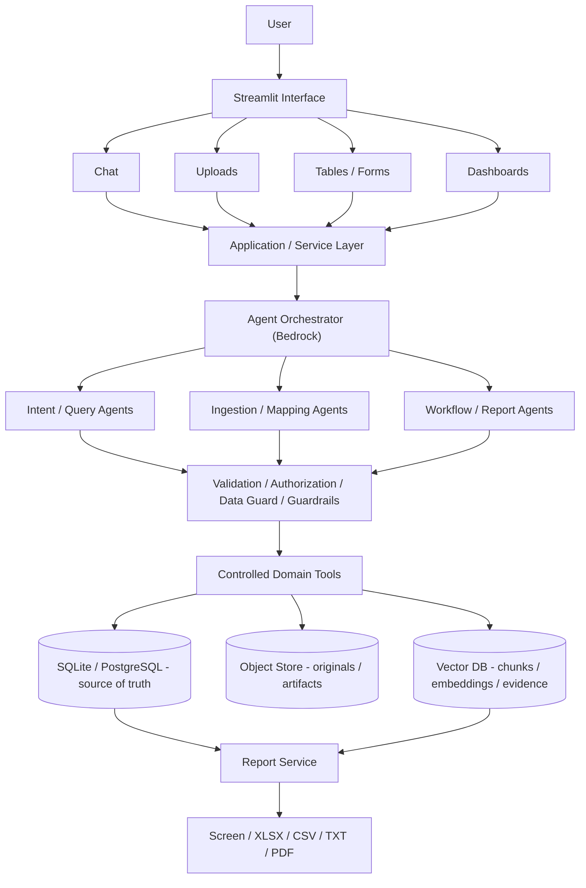
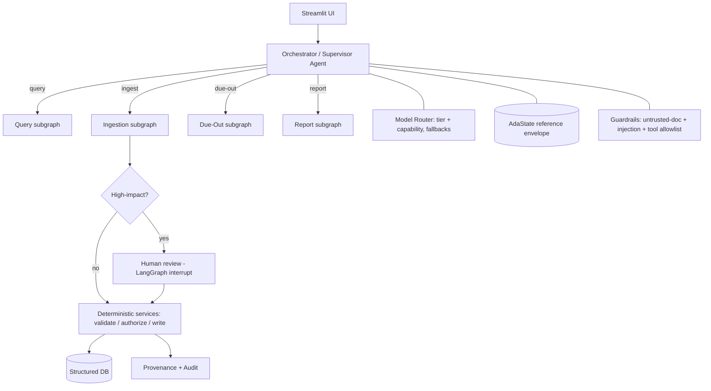

# Ada - Product Overview

**Ada** stands for **AI-Driven Assistant**.

## What it is

Ada is a conversational, agentic assistant that makes personnel, training, and operational
record-keeping easy. Users talk to Ada in natural language, upload messy files, and get back
clean, structured, auditable data and reports.

## Architecture at a glance

> Diagrams are **living** and will be updated as the design evolves. Full set with
> explanations: [`diagrams.md`](diagrams.md).

**System (target architecture, simplified):**

**Agentic flow (multi-agent, simplified):**

## Positioning

- **Core is general.** People, organizations, training/compliance, tasks with deadlines,
  administrative actions, and documents exist in almost every workforce.
- **First application profile is military-flavored** (staff sections, reporting cycles,
  due-outs, ETS/PCS). This is an *initial profile*, not the product identity. A neutral
  `general` profile adapts the same core to civilian HR.

## Stack

- **UI:** Streamlit (presentation layer only)
- **LLM:** AWS Bedrock (sole LLM runtime for v1) via Strands
- **AWS auth:** `boto3.Session` using `AWS_PROFILE` + `AWS_REGION`
- **Source of truth:** relational DB (SQLite local default; PostgreSQL opt-in/production path)
- **Object storage:** local filesystem default; S3 production path for original files/artifacts
- **Semantic store:** Chroma / vector DB for policy/document chunks, embeddings, and evidence
- **Config namespace:** `ADA__*` (plus standard `AWS_*`)

## Naming and conventions

- Product name: **Ada**
- Python package: `ada` (`src/ada/`)
- GitHub: `https://github.com/mli-cyber/ada`
- Environment prefix: `ADA__*`

## Documentation

- [`roadmap_v3.md`](roadmap_v3.md) - the active roadmap (Phases 0-19), which supersedes the
  earlier v2 roadmap.
- [`diagrams.md`](diagrams.md) - all architecture & flow diagrams with explanations.
- [`phase_0.md`](phase_0.md) - the concrete Phase 0 (foundation) build plan.
