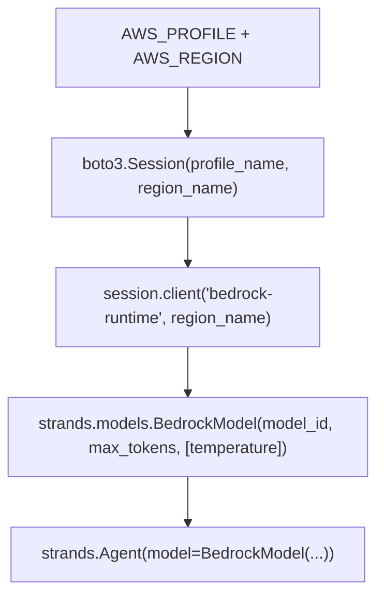
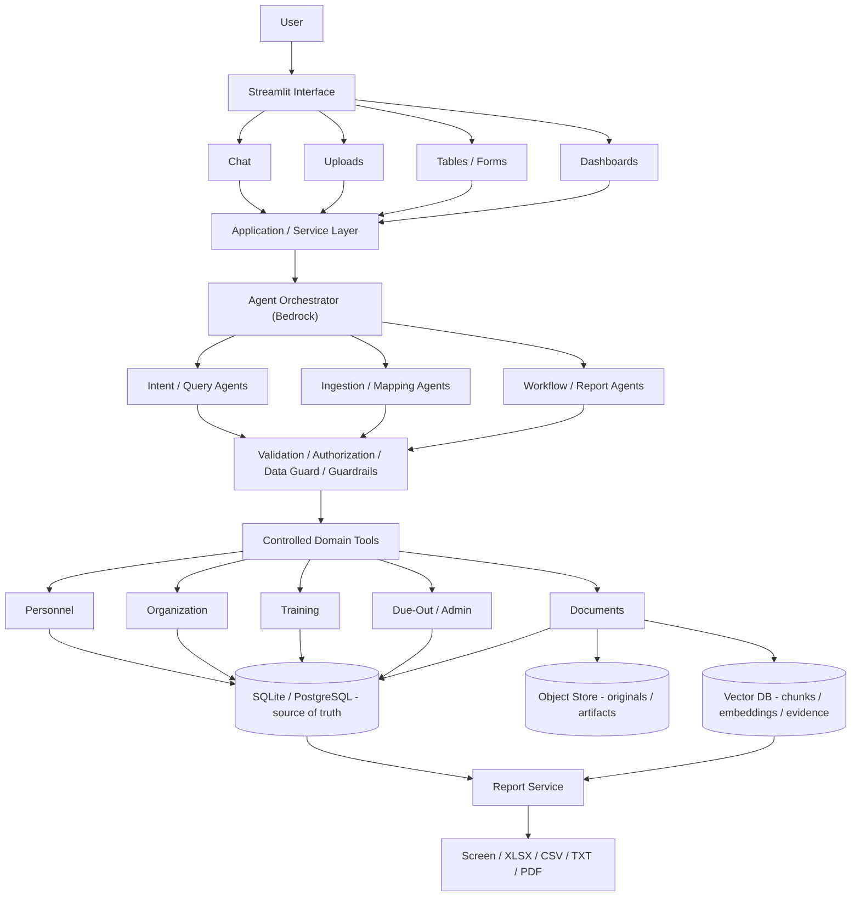
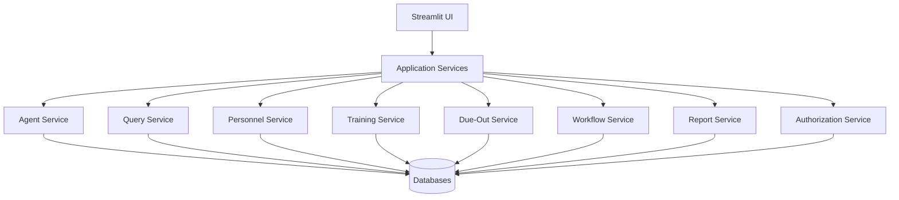
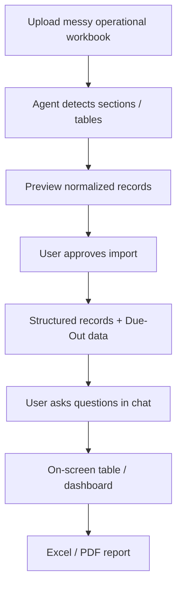
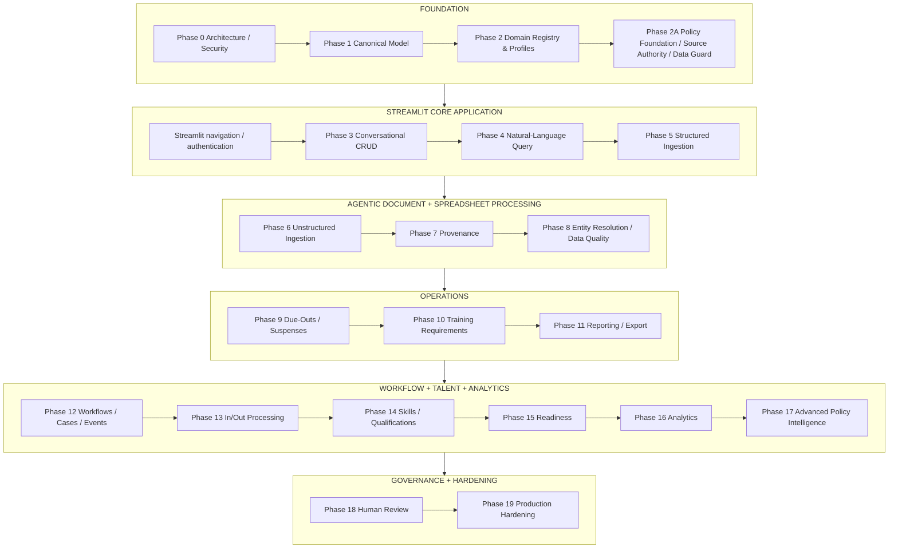
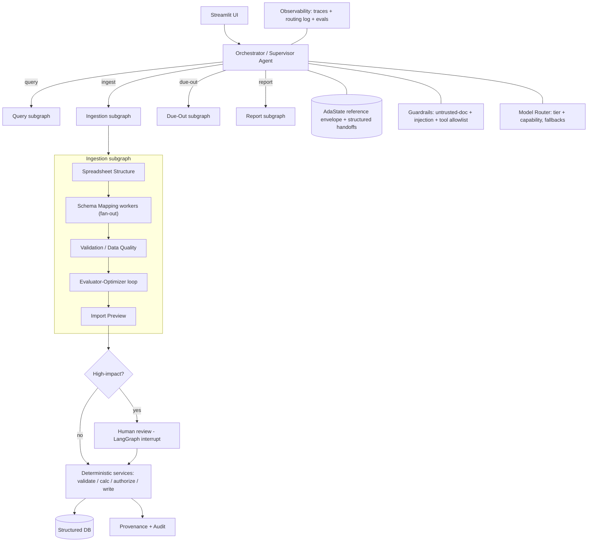
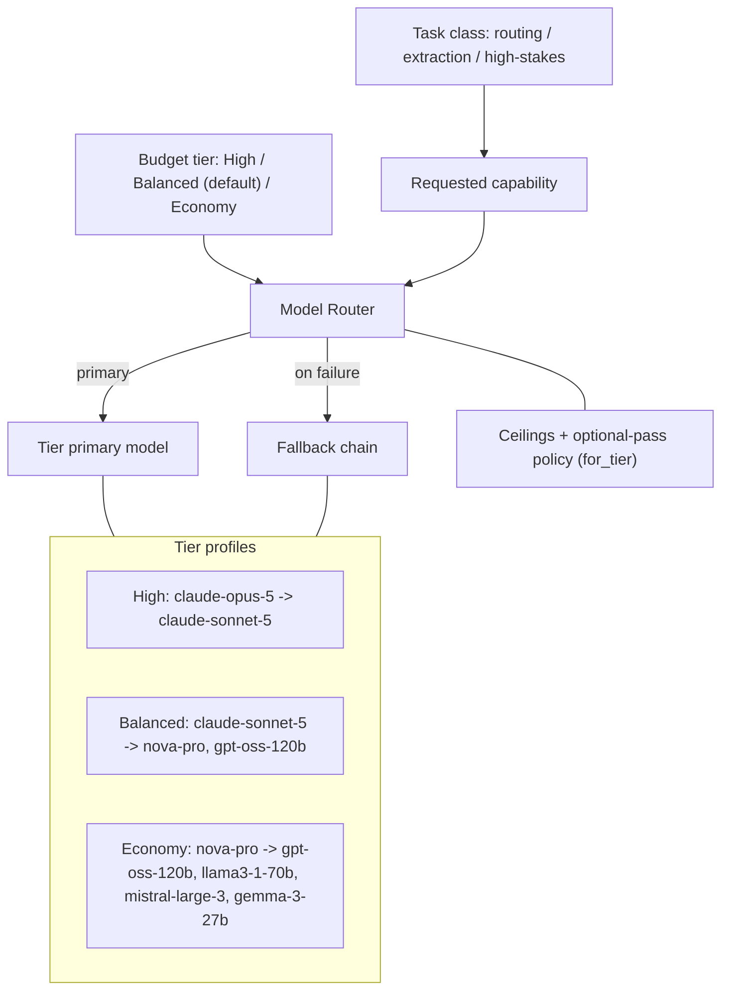

# Ada — Personnel, Training & Operations Assistant Roadmap (v3)

> **Ada** = *AI-Driven Assistant*. This document is **roadmap v3** and **supersedes v2**
> (`agentic_hr_personnel_training_portal_roadmap_v2.md`, retained as a historical reference
> under [`new_ideas/`](new_ideas/)). v3 rebrands the
> product as Ada, fixes the technology stack on **AWS Bedrock + Streamlit**, generalizes
> the product beyond its initial military application, and completes every development
> phase with a fixed delivery template.

> **Living diagrams (subject to change).** All flowcharts in this document reflect the
> *current* design intent and are expected to evolve. As the architecture is refined or as
> phases are implemented, these diagrams will be **updated/replaced** to match. If a diagram
> ever diverges from the implementation, treat the code and the per-phase docs (e.g.
> [`phase_0.md`](phase_0.md)) as the source of truth. A standalone collection of all
> diagrams with explanations lives in [`diagrams.md`](diagrams.md).

---

## 1. Project Purpose

**Ada** is a conversational, agentic assistant for **personnel, training, organizational,
and administrative data management**. It makes HR-style record keeping and task tracking
easy: users talk to Ada in natural language, upload messy files, and get back clean,
structured, auditable data and reports.

Ada allows users to:

- Upload and ingest `XLSX`, `CSV`, `TXT`, `PDF`, `DOC`, and `DOCX` files (`PPTX` planned).
- Extract, normalize, validate, and store information in structured databases.
- Manage personnel, training, organization, administrative actions, and due-outs (tasks
  with suspenses) through a natural-language chat interface.
- Use **Streamlit** as the initial application interface for chat, file upload, editable
  tables, dashboards, review screens, and report downloads.
- Add, retrieve, update, deactivate, and search records without knowing SQL.
- Ask follow-up questions conversationally.
- Generate outputs as on-screen answers, on-screen tables, Excel, CSV, TXT, PDF, and
  secure/downloadable URLs.
- Track provenance and supporting evidence for extracted or modified information.
- Support multiple domains/databases that can be added over time.

### Relationship to IWB

Ada **reuses architectural patterns** proven in the AISI Intelligence Workbench (IWB) —
agent orchestration, document ingestion, vector/RAG retrieval, canonical structured state,
provenance, validation, confidence handling, durable workflows/checkpoints, human review,
and report generation. IWB is a **pattern source, not a parent product**. Ada is its own
product with its own brand, package (`ada`), and configuration namespace (`ADA__*`).

---

## 2. Product Positioning and Application Profiles

Ada's **core is general**: people, organizations, training/compliance, tasks with
deadlines, administrative actions, and documents exist in almost every workforce.

Ada's **first application profile is military-flavored** (staff sections, reporting/Battle
Assembly cycles, ETS/PCS, alert rosters). These are an **initial profile**, not the product
identity. A **profile** is a first-class configuration concept (see item in Section 4 and
Phase 2) that:

- Swaps terminology in prompts, labels, and reports.
- Toggles which domains and report templates are enabled.
- Provides profile-specific validation and defaults.

### Terminology map (military ↔ general)

| Military profile term | General profile term |
|---|---|
| Staff section (S-1, J21) | Department / team |
| Battle Assembly (BA) / reporting cycle | Reporting period / cycle |
| Due-out / suspense | Task / action item with deadline |
| ETS / out-processing | Offboarding |
| In-processing | Onboarding |
| Soldier / Service Member | Employee / member |
| Rank / grade | Level / grade |
| Alert roster | Contact roster |

The data model uses neutral internal names (`person`, `organization`, `assignment`,
`due_out`); profiles supply the display vocabulary.

---

## 3. Technology Stack

| Concern | Choice | Notes |
|---|---|---|
| UI | **Streamlit** | Presentation layer only (MVP + early releases) |
| LLM runtime | **AWS Bedrock** | Sole LLM runtime for v1 |
| Agent framework | **Strands** (`strands-agents`, `BedrockModel`) | Same pattern as IWB |
| AWS auth | `boto3.Session` via `AWS_PROFILE` + `AWS_REGION` | Reuses the operator's existing SSO/IAM profile |
| Chat models | Bedrock model registry via `ADA__MODELS_HIGH/BALANCED/ECONOMY` | Capability-based Model Router with fallbacks (Phase 3+) |
| Embeddings | `amazon.titan-embed-text-v2:0` (fixed) | Switching invalidates the vector space |
| Source of truth | **Relational DB** (SQLite local default; PostgreSQL opt-in/prod) | Structured records and document metadata |
| Semantic store | **Chroma / vector DB** | Policy/document chunks, embeddings, evidence |
| Object storage | Local filesystem (default) / **S3** (prod) | Documents and generated artifacts |
| Secrets | env (default) / AWS Secrets Manager / SSM | `ADA__SECRETS_BACKEND` |
| Packaging | `uv` + `pyproject.toml`, Python `>=3.13` | Mirrors IWB |
| Config namespace | `ADA__*` (+ standard `AWS_*`) | No `AISI` prefix |

### AWS Bedrock connection pattern



Anthropic models on Bedrock reject a custom `temperature`; Ada follows IWB and omits it for
that provider. All AWS/Bedrock settings resolve from the environment through `AdaConfig`.

### Local-first defaults

Ada runs fully local by default (SQLite + local Chroma + local object store); the only
hard cloud dependency is **Bedrock** for embeddings and generation. Production adapters
(Postgres, S3, Secrets Manager) are opt-in via `ADA__*` variables.

---

## 4. Target Architecture



### 4.1 Streamlit interface strategy

Use **Streamlit as the presentation layer only** for the MVP and early operational
releases. It is a strong fit because Ada is Python-based, data-centric, LLM/chat-centric,
file-ingestion heavy, table/report heavy, and internal/enterprise-workflow oriented.

**Initial pages**

```text
Ada
│
├── Home / Dashboard
├── My Work            # unified operational queue (see 4.4)
├── AI Assistant
├── Personnel
├── Organization / Assignments
├── Training
├── Due-Outs / Suspenses
├── Administrative Actions
├── File Import / Review
├── Reports
├── Data Quality / Review Queue / Reconciliation
└── Administration
```

**Architecture rule:** Do not place core rules, LLM orchestration, database logic, or
authorization inside page scripts. Streamlit calls stable **application services**:



**Session-state rule:** Use Streamlit session state only for transient UI state (filters,
current selection, chat display). Persist durable state (conversations, checkpoints, pending
approvals, change sets, report jobs, due-out state, import staging) in the backend.

**Auth vs. authz:** The UI may authenticate via enterprise identity/OIDC. **Authorization
remains application-controlled** (which domains, organizations, PII fields, write
operations, reports, and bulk actions a user may access).

### 4.2 Core architectural principles

- **Structured DB is the source of truth.** The object store holds original files; the vector
  DB holds policy/document chunks, embeddings, evidence, and semantic retrieval data — never
  the authoritative personnel/training record.
- **LLMs interpret; deterministic services execute.** LLMs interpret intent, extract, map
  schemas, explain, and summarize. Deterministic code validates, calculates dates/compliance/
  readiness, authorizes, writes, and generates exports.
- **No unrestricted SQL for the LLM.** Provide controlled domain tools (`create_person()`,
  `update_person()`, `search_people()`, `assign_person()`, …), never `execute_sql(...)`.
- **Agents for ambiguity; deterministic code for known rules.** Use agents where *language or
  document structure is ambiguous* (intent, schema mapping, spreadsheet structure, extraction,
  entity-resolution assistance, due-out free-text, policy routing/applicability/conflict,
  report narrative). Keep these **deterministic** (never agents): authorization, policy
  resolution, compliance/overdue/readiness calculation, database writes, workflow-state
  transitions, report-dataset generation, organization roll-ups, retention enforcement.

### 4.3 Application-profile mechanism

A **profile** is a registered config bundle: `{ terminology, enabled_domains,
report_templates, defaults, validation_overrides, policy_bundles, workflow_templates }`. The
`military` profile ships first; a neutral `general` profile is the fallback. Profiles are
resolved at startup (`ADA__PROFILE=military|general`) and injected into prompts, labels, the
domain registry, **and the policy/default/workflow bundles (Phase 2A)** so the same core serves
multiple markets.

### 4.4 My Work (unified operational queue)

The strongest daily-use question is "*what do I need to do today?*". **My Work** is a primary
page that aggregates, per user/scope, the operational items otherwise spread across pages:
tasks, due-outs, approvals, policy reviews, data-quality/reconciliation items, upcoming
deadlines, escalations, and blocked actions. It reads from existing domains (no new source of
truth) and becomes a headline UX from Phase 9 onward.

---

## 5. Proposed Domain Databases

Initially separate logical schemas within one relational database: PostgreSQL schemas in
production and a flat, prefixed table namespace under the SQLite local default — not separate
servers/databases.

```text
ada_platform
│
├── identity
├── organization
├── training
├── due_out
├── administrative
├── documents
├── readiness
└── audit
```

### 5.1 Personnel / Identity domain

```text
Person
├── person_id
├── first_name
├── middle_name
├── last_name
├── preferred_name
├── rank_grade          # profile-labeled (rank | level)
├── service_component   # profile-labeled
├── official_email
├── duty_phone
├── status
├── created_at
└── updated_at
```

Sensitive data is isolated:

```text
SensitiveIdentity
├── person_id
├── national_id_encrypted   # e.g. SSN/DoD ID, encrypted
├── date_of_birth
└── access_classification
```

Rules: national IDs are never primary keys; all domains reference internal `person_id`;
`Contact` and `EmergencyContact` are separate entities.

### 5.2 Organization / Assignment domain

```text
Organization
├── organization_id
├── name
├── abbreviation
├── parent_organization_id
├── organization_type
├── location
└── status

Position
├── position_id
├── organization_id
├── position_name
├── duty_title
├── grade_requirement
├── skill_requirement
├── clearance_requirement
├── training_profile_id
└── status

Assignment
├── assignment_id
├── person_id
├── organization_id
├── position_id
├── duty_title
├── arrival_date
├── assignment_start_date
├── estimated_departure_date
├── actual_departure_date
├── supervisor_id
└── assignment_status
```

### 5.3 Training domain

```text
Course
├── course_id
├── course_name
├── course_code
├── provider
├── description
├── renewal_period
├── mandatory_optional
├── delivery_method
└── status

TrainingRequirement
├── requirement_id
├── course_id
├── applicable_org
├── applicable_position
├── applicable_grade
├── applicable_role
├── effective_date
├── expiration_date
├── recurring_interval
├── authority
├── supersedes_requirement
└── status

TrainingRecord
├── person_id
├── course_id
├── assigned_date
├── due_date
├── completion_date
├── expiration_date
├── completion_status
├── score
├── certificate
├── source
└── evidence_id
```

Supports both required and optional/individual training.

### 5.4 Administrative domain

```text
AdministrativeAction
├── action_id
├── person_id
├── action_type
├── start_date
├── due_date
├── completion_date
├── status
├── assigned_to
├── approving_authority
├── notes
└── source
```

Action types: Leave, Award, Evaluation, Counseling, In-processing, Out-processing,
Promotion, PCS, TDY, School application, Personnel request, Access request, Account request,
Equipment issue/turn-in.

### 5.5 Leave / Absence domain

```text
Absence
├── absence_id
├── person_id
├── absence_type
├── start_date
├── end_date
├── approval_status
├── approving_authority
└── notes
```

Types: Leave, Pass, TDY, Administrative absence, Parental leave, Convalescent leave, Other.

### 5.6 Due-Out / Suspense domain

Due-outs are a **first-class operational domain** (suspense, ownership, reporting cycle,
escalation, workflow, and response) across Personnel, Training, Organization, and
Administrative domains — not spreadsheet columns or free text.

```text
DueOutTemplate
├── template_id
├── title
├── description
├── category
├── staff_section
├── due_out_type
├── recurrence
├── default_owner
├── required_organizations[]
├── default_due_rule
├── instructions
├── authority
├── active
└── version

DueOut                      # instance for a reporting cycle
├── due_out_id
├── template_id
├── reporting_cycle_id
├── title
├── description
├── category
├── staff_section
├── due_out_type
├── priority
├── effective_date
├── due_date
├── status
├── owner
├── requesting_org
├── instructions
├── source
└── active

DueOutResponse              # per-organization response
├── response_id
├── due_out_id
├── organization_id
├── assigned_to
├── status
├── numerator
├── denominator
├── numeric_value
├── text_value
├── date_value
├── submitted_date
├── updated_date
├── notes
└── evidence_id

DueOutAction               # per-person action
├── action_id
├── due_out_id
├── person_id
├── organization_id
├── assigned_to
├── required_action
├── due_date
├── estimated_completion_date
├── canonical_status
├── status_detail
├── blocker
├── latest_update
├── completed_date
└── evidence_id

DueOutBlocker
├── blocker_id
├── due_out_action_id
├── blocker_type
├── description
├── responsible_party
├── opened_date
├── resolved_date
└── status

DueOutDependency
├── due_out_id
├── depends_on_due_out_id
└── dependency_type

ReportingCycle
├── cycle_id
├── name
├── start_date
├── end_date
├── reporting_date
├── cycle_type
└── status
```

**Typed outputs:** `BOOLEAN, COUNT, RATIO, PERCENTAGE, TEXT, DATE, DOCUMENT, PERSON_LIST,
PERSON_ACTION, DATASET, CHECKLIST`. Store ratios as structured values, not strings.

**Canonical status** (normalize free text, preserve original): `NOT_STARTED, IN_PROGRESS,
WAITING_ON_PERSON, WAITING_ON_EXTERNAL, SUBMITTED, RETURNED_FOR_CORRECTION, SCHEDULED,
BLOCKED, COMPLETE, OVERDUE, CANCELLED, NOT_APPLICABLE, NEEDS_REVIEW`.

**Blocker types:** `AWAITING_PERSON, AWAITING_SUPERVISOR, AWAITING_COMMAND,
AWAITING_EXTERNAL_ORG, MISSING_DOCUMENT, SYSTEM_ISSUE, SCHEDULING_UNAVAILABLE,
PENDING_TRANSFER, PENDING_RETIREMENT, OTHER`.

Recurring templates instantiate automatically per applicable reporting cycle. Escalation is
configurable (e.g., 30/14/7 days → owner → owner+supervisor → priority → escalation queue).
Due-outs reference authoritative records rather than duplicating them.

### 5.7 Document / Evidence domain

```text
Document
├── document_id
├── filename
├── document_type
├── uploaded_by
├── upload_date
├── storage_location
├── hash
├── version
├── classification
├── pii_level
└── status

Evidence
├── evidence_id
├── document_id
├── entity_type
├── entity_id
├── page
├── row
├── section
├── extracted_text
├── confidence
└── extraction_agent
```

### 5.8 Future domains

Qualifications, Certifications, Skills, Education, Experience, Awards, Travel, Equipment,
Access/accounts, In-processing, Out-processing, Readiness, Recruiting, Performance.

### 5.9 External-source connector framework (future)

The MVP is file-upload-driven, but later integrations should not require re-architecting.
Define a `SourceConnector` interface now (implement post-MVP): `{ connector_id, source_system,
domain, authority, mapping, sync_strategy, organization_scope, last_sync, status }`, feeding the
same staging → mapping → validation → **reconciliation** (7.9) → structured DB path. Future
sources: HR system, training system, SharePoint, S3, database, REST API.

---

## 6. Canonical State, Field Policy, and Domain Registry

### 6.1 Canonical state — a lightweight reference envelope

`AdaState` is the serializable, provenance-carrying state passed between agents/workflow nodes.
It must stay **small**: it holds **references and working context, not full domain datasets**
(records stay in SQL). This keeps LangGraph checkpoints small, avoids duplicating DB state,
limits accidental PII exposure, and scales to large organizations.

```text
AdaState
├── request_id                ├── result_ref
├── conversation_id           ├── document_refs[]
├── user_context              ├── evidence_refs[]
├── intent                    ├── applicable_rule_refs[]
├── task_type                 ├── validation_issues[]
├── organization_scope[]      ├── unresolved_questions[]
├── selected_entity_refs[]    ├── change_set_id
├── query_plan                ├── approval_id
└── workflow_status           └── provenance_refs[]
```

Bulk domain collections (people[], due_outs[], …) are **retrieved on demand from SQL** for a
step and referenced by id/scope, never carried wholesale inside `AdaState`.

### 6.2 Field handling policy

Each field declares missing-value handling: `REQUIRED, RECOMMENDED, OPTIONAL, DEFAULTABLE`.
Example (`Person`): `name REQUIRED`, `employee_id RECOMMENDED`, others `OPTIONAL`,
`status DEFAULT=ACTIVE`, `created_at DEFAULT=now`. Ada asks about missing recommended fields
and honors instructions like "use defaults or leave optional fields blank."

### 6.3 Domain registry

Each domain registers: schema, entities, relationships, validation rules, permissions, CRUD
tools, report templates, PII classification, vector collections, agent-access rules, and
**profile bindings**. New domains are added without redesigning the orchestrator.

---

## 7. Cross-Cutting Concerns (apply to every phase)

These concerns are designed once and enforced across all phases. Full hardening is Phase 19,
but the contracts below are non-negotiable from Phase 0.

### 7.1 Untrusted-document & prompt-injection handling

- Treat **all ingested file content** (PDF/DOCX/XLSX/CSV/TXT) as **untrusted data, never
  instructions**. Document text is placed in clearly delimited data context, separate from
  agent system/tool instructions.
- Ingestion and extraction agents **may never trigger writes or tool calls that mutate
  state** without an explicit human confirmation step.
- Strip/escape control sequences; ignore embedded "instructions" in documents.
- Adversarial-prompt tests are part of the eval suite (Section 10).

### 7.2 Bedrock guardrails & cost/token governance

- **Model routing + fallbacks** (reuse the IWB router pattern): per-tier allowlists with
  graceful fallback.
- **Multi-model tiers (budget mode):** a `ModelRegistry` + Model Router with **3 tiers**
  (`high`|`balanced`|`economy`, default `balanced`, `ADA__MODEL_TIER`) resolved by
  `CostGuardrails.for_tier`, each with a **primary + fallback chain**:
  **high** = `claude-opus-5` -> `claude-sonnet-5` (optional passes on);
  **balanced** = `claude-sonnet-5` -> `nova-pro`, `gpt-oss-120b` (evaluator on/debate off);
  **economy** = `nova-pro` -> `gpt-oss-120b`, `llama3-1-70b`, `mistral-large-3`, `gemma-3-27b`
  (optional passes off). A **task-class-to-capability map** translates routing/classification,
  extraction/mapping/reasoning, and high-stakes work into the capability requests below.
  Lower tiers are a cost/quality lever, **not** a kill switch: the required pipeline
  (parse, map, validate, extract, provenance, audit, authorize, human review) always runs.
  Registry + contract + Admin toggle land in Phase 0; the Model Router consumes them from
  Phase 3+. Embeddings stay fixed (`amazon.titan-embed-text-v2:0`).
- **Capability-based routing (reduce model-name coupling):** architecture/agents request a
  **capability** - `FAST_ROUTING`, `STRUCTURED_EXTRACTION`, `COMPLEX_REASONING`, `MULTIMODAL`,
  `HIGH_STAKES_REVIEW` - and config maps each capability (× budget tier) to current Bedrock
  model IDs. Agents never hard-code model names; only the registry config does.
- **Per-request ceilings:** max tokens, bounded agent loops, max agent calls per document/
  task, and time budgets (tier-scaled).
- **PII redaction** via Bedrock Guardrails on inputs/outputs where configured.
- **Prompt versioning:** every agent prompt has a version recorded in provenance/audit.
- Cross-references the confirmation/risk model (Section 14).

### 7.3 Temporal & audit data model

- History/versioning for mutable records (e.g., `Assignment` history), **soft-delete**
  (`status`/`deactivated_at`) preferred over hard delete; hard delete is an explicit,
  audited, high-impact action.
- Effective-dating beyond training requirements where records have validity windows.
- **Point-in-time / `as_of` reporting:** historical questions ("what was 2 DSB readiness at the
  August cycle?") must resolve against historical state, not today's records - via
  effective-dated queries or a `ReportSnapshot` (`snapshot_id, reporting_cycle_id, as_of,
  dataset_ref, generated_at, source_versions[]`). Operational reports must be reproducible.

### 7.4 Change-set & undo model

- Chat-driven and bulk writes are grouped into **change sets** that are previewable,
  approvable, and **reversible**, paired with the audit trail (Section 15) and confirmation
  model (Section 14).

### 7.5 RBAC & PII tiers

- Explicit **role × permission matrix** (e.g., `viewer, editor, approver, admin`) and
  **field-level PII tiers** (public / internal / sensitive) built on `SensitiveIdentity`.
- Authorization is enforced in the service/tool layer, not the UI.

### 7.6 Deployment / infrastructure target

- Local-first now; production path on AWS: **RDS Postgres**, **S3**, **Bedrock**, **KMS**
  for encryption, and **ECS/Fargate** as the default container runtime. EKS remains an
  optional adapter where an existing Kubernetes platform requires it. Reuse IWB's
  `Dockerfile` pattern.

### 7.7 Time & date normalization

- A shared date/time service normalizes Excel serials, `YYYYMMDD`, `MM/DD/YYYY`, free-text
  and `TBD`/`N/A` into typed fields (`actual_date`, `estimated_date`, `due_date`,
  `completion_date`, `status_update_date`); the **original value is always preserved** for
  provenance. Timezone handling is explicit for due dates and reporting cycles.

### 7.8 LLM Data Guard (minimum-necessary)

- Authorization answers "*can this user access this record?*"; the **Data Guard** additionally
  answers "*does the model need this field to answer this question?*". It sits between
  authorized data and the model: `DB -> controlled tool -> authorization -> LLM Data Guard ->
  minimum-necessary dataset -> agent`, with per-field decisions `ALLOW / MASK / REDACT / DENY`.
- Backed by `FieldDefinition` metadata (`entity, field, sensitivity, pii_category, llm_access,
  export_policy, mask_policy, audit_policy`). Example: an "overdue training" query passes name/
  org/course/status to the model but **never** SSN/DOB/home-address/personal-phone.
- Established in Phase 0/2A; enforced everywhere agents receive data.

### 7.9 Source authority & reconciliation

- Ada tracks the **system of record** per source and field: `Source` + `SourceAuthorityPolicy`
  (field-level `preferred_source` / `fallback_source` / `conflict_behavior`). Conflict
  *detection* (Phase 8) is not enough - precedence decides which source wins (e.g.
  `Assignment.departure_date` -> personnel system; uploaded memo -> evidence only; user entry ->
  provisional until approved).
- A **Reconciliation Center** (Streamlit) surfaces unresolved conflicts with a recommended
  resolution and `Accept / Override / Investigate` actions. Authoritative records are never
  silently overwritten.

### 7.10 CI/CD and software-supply-chain controls

- **Phase 0 CI (required on every pull request):** locked `uv` dependency sync, Ruff, unit
  type checking, tests excluding the `integration` marker, Markdown-link and Mermaid
  validation, dependency/secret scanning, and a guard that fails if anything under `data/`
  is tracked. CI uses no AWS credentials.
- **Security automation:** secret scanning, dependency update/scanning, least-privilege
  workflow permissions, and third-party Actions pinned to immutable commit SHAs.
- **Bedrock integration workflow:** manual `workflow_dispatch` only, protected by a GitHub
  Environment and AWS OIDC federation to a least-privilege Bedrock invoke role. Never store
  long-lived AWS access keys in GitHub.
- **Branch protection:** require CI checks and review before merging to the default branch.
- **Phase 19 CD:** build one immutable container artifact; generate an SBOM; scan and sign the
  image; promote the same digest through dev → staging → production; use environment approvals,
  pre-deploy migration/backup checks, health checks, and automatic rollback. Production
  deployment uses GitHub OIDC and ECS/Fargate by default.

---

## 8. Non-Functional Requirements (initial targets)

| Dimension | Initial target (MVP) | Notes |
|---|---|---|
| Scale | 50k persons, 500k training records, 100k due-out actions | Postgres-backed; paginate UI |
| Concurrency | 25 concurrent internal users | Streamlit + service layer |
| Bedrock latency budget | Chat < 8s p50 / < 20s p95; extraction batched | Router picks model; timeouts bounded |
| Ingestion | 10k-row workbook processed with preview < 5 min | Bounded agent loops |
| Availability | Business-hours internal use; graceful degradation if Bedrock unavailable | Local stores stay readable |
| Data retention | Configurable; audit retained ≥ 1 year by default | `ADA__*` retention knobs |
| Cost | Per-request token ceilings; per-day soft budget alerting | Governance (7.2) |
| Delivery | Required PR CI; no long-lived cloud credentials; reproducible locked builds | CD promotion/rollback in Phase 19 |

These are starting targets, refined during Phase 19.

---

## 9. Development Roadmap

Every phase uses the same template: **Goal · Scope / non-goals · Deliverables · Repo targets
· Depends on · Exit criteria · Test / demo notes**.

Repo targets reference the scaffold created in this repo:
`src/ada/{config.py, bedrock.py, platform/, domain/, registry/, agents/, tools/, services/,
ingestion/, provenance/, quality/, reports/, workflows/}`, plus `app/`, `evals/`, `tests/`.

> **Phase numbering:** v3 renumbers the former "Phase 8A" (Due-Out Management) to **Phase 9**
> and shifts every subsequent legacy phase by one, giving Phases 0–19. **Phase 2A** is a
> deliberate inserted foundation and does not renumber the legacy topic sequence.

| v3 phase | Topic | Was (v2) |
|---|---|---|
| 0 | Architecture & Security Foundation | 0 |
| 1 | Canonical Domain Model | 1 |
| 2 | Domain Registry & Profiles | 2 |
| 2A | Policy Foundation, Source Authority & Data Guard | (new) |
| 3 | Conversational CRUD | 3 |
| 4 | Natural-Language Query Engine | 4 |
| 5 | Structured File Ingestion | 5 |
| 6 | Unstructured Document Ingestion | 6 |
| 7 | Provenance & Evidence Engine | 7 |
| 8 | Entity Resolution, Data Quality & Reconciliation | 8 |
| 9 | Due-Out / Suspense Management | 8A |
| 10 | Training Requirement Engine | 9 |
| 11 | Reporting & Export Framework | 10 |
| 12 | Administrative Workflow Engine, Case Management & Domain Events | 11 |
| 13 | In/Out-Processing Automation | 12 |
| 14 | Qualifications, Certs, Skills, Education | 13 |
| 15 | Personnel Readiness Engine | 14 |
| 16 | Advanced Reporting & Analytics | 15 |
| 17 | Advanced Policy Intelligence & Change Impact | 16 |
| 18 | Human Review & Approval | 17 |
| 19 | Production Hardening | 18 |

---

### Phase 0 — Architecture and Security Foundation

> **Detailed build plan:** see [`phase_0.md`](phase_0.md). Locked decisions: SQLite-default
> DB (`ADA__DB_URL`; Postgres opt-in), dev-auth RBAC + PII tiers (application-user OIDC
> deferred to Phase 19),
> functional local adapters. **Deferred to later phases:** the synthetic **input-data
> generator** and **field crosswalk** (test data mimicking user input files such as the
> due-out workbook) move to **Phase 5**; structured parsing / normalized ground truth to
> Phase 1/5; the chat/entry demo script to Phase 3. **Before any `git add`:** add the entire
> `data/` directory to `.gitignore` (real + synthetic stay local-only); tracked sample
> fixtures live under `samples/`.

- **Goal:** Establish architecture and security boundaries before processing real data.
- **Scope / non-goals:** Foundations, config, and boundaries only. No domain CRUD, no
  structured ingestion/parsing, no live assistant product. (A file-intake *subset* that only
  stores + registers uploaded files, without parsing, is in scope.)
- **Deliverables:** Frontend/chat architecture; agent-orchestration boundary; DB access
  layer (SQLite local default + PostgreSQL adapter); vector DB; object/document storage;
  authentication;
  RBAC skeleton; field-level PII restrictions; encryption requirements; secrets management;
  audit logging; retention/deletion policy; document classification/PII tagging;
  no-unrestricted-SQL guarantee; Bedrock client boundary; profile mechanism stub;
  untrusted-document contract (7.1); guardrail/cost contract (7.2); **file-intake subset**
  (store + register + classify, no parsing); **local reset utility** (clear local stores +
  re-init); **small synthetic seed fixture** (`samples/phase0_seed/`) to validate boundaries;
  **LLM Data Guard** contract (7.8); minimal `ReviewRequest`/`ApprovalDecision` primitive;
  early `SourceRef`/`EvidenceRef`/`ProvenanceRef` contract; model registry with
  capability-based routing; **PR CI and supply-chain baseline** (7.10).
- **Repo targets:** `src/ada/config.py`, `src/ada/bedrock.py`, `src/ada/platform/*`
  (identity, dataguard, review, audit, secrets, storage, db, vectors, guardrails, intake,
  maintenance), `src/ada/models/registry.py`, `src/ada/provenance/refs.py`, `app/`,
  `example.env`, `doc/architecture.md`, `samples/phase0_seed/`, `.github/workflows/ci.yml`,
  `.github/workflows/bedrock-integration.yml`, `.github/dependabot.yml`,
  `scripts/check_docs.py`.
- **Depends on:** —
- **Exit criteria:** Base architecture documented; auth/authz and PII models established;
  Data Guard, review, provenance-ref, and model-registry contracts usable; structured DB,
  vector DB, and object storage available; Bedrock reachable via `AWS_PROFILE`/`AWS_REGION`;
  required PR checks are reproducible locally and CI contains no AWS credentials.
- **Test / demo notes:** Config loads from env; Bedrock session constructs; Streamlit shell
  launches with placeholder pages; Administration page shows health badges + a seed-driven
  PII-redaction demo; a file can be intake'd (store + register + audit); `reset_local` clears
  local stores; PR CI passes and the manually dispatched Bedrock workflow authenticates via
  OIDC after its protected GitHub Environment is configured.

### Phase 1 — Canonical Domain Model

- **Goal:** Implement the initial structured data model.
- **Scope / non-goals:** Schema + CRUD service layer. No chat, no ingestion.
- **Initial domains:** Personnel, Organization, Training, Due-Out, Administrative,
  Documents.
- **Deliverables:** Entities, relationships, IDs/keys, field policies, validation rules, PII
  classification, DB migrations, sample/test data, canonical `AdaState` (envelope, 6.1);
  temporal/soft-delete + `as_of` policy (7.3); **organization hierarchy/roll-up services**
  (`OrganizationHierarchyService`, `OrganizationScopeService`, `RollupService`) with
  parent→child scope + config inheritance (BDE→BN→CO); persistence/service integration for
  the Phase 0 **review primitive** and early **provenance-ref contract**.
- **Repo targets:** `src/ada/domain/*`, migrations, `src/ada/services/*` (CRUD, hierarchy,
  review integration), `src/ada/provenance/*` (domain linkage).
- **Depends on:** Phase 0.
- **Exit criteria:** Schemas implemented; relationships validated; test data available; CRUD
  service layer available; org roll-up returns descendant scope; Phase 0 review/provenance
  contracts integrated with domain persistence and services.
- **Test / demo notes:** DB + schema tests green; seed data loads; "show 2 DSB" resolves to
  descendant orgs.

### Phase 2 — Domain Registry and Profiles

- **Goal:** Add domains/profiles without changing the core architecture.
- **Scope / non-goals:** Registry + profile config. No new business domains yet.
- **Deliverables:** Domain registry; registration interface; register initial domains;
  domain-specific tool/validation/permission/report-template registration; **application-
  profile mechanism** (4.3) with `military` and `general` profiles.
- **Repo targets:** `src/ada/registry/*`, profile config under `src/ada/config.py`/registry.
- **Depends on:** Phase 1.
- **Exit criteria:** A developer can add a domain without changing the orchestrator; switching
  `ADA__PROFILE` swaps terminology and enabled domains.
- **Test / demo notes:** Registry unit tests; profile-swap snapshot test.

### Phase 2A — Policy Foundation, Source Authority & Data Guard  *(inserted; foundational)*

- **Goal:** Make Ada **policy-aware, source-aware, and minimum-necessary** before operational
  logic (training, due-outs, workflows) becomes coupled to hard-coded rules. Adding this late
  would force redesign of earlier logic.
- **Scope / non-goals:** Foundational policy/rule/source model + resolution + data guard. Not
  the advanced policy comparison/change-impact work (that stays in Phase 17).
- **Deliverables:**
  - **Policy Registry & rules:** `PolicyDocument`, `PolicyRule`, `CandidateRule`, `PolicyGap`,
    `TaskPolicyLink`, `ApplicablePolicySet`, `RuleVersion`, `LocalDefault`.
  - **Rule-source types:** `AUTHORITATIVE` (approved governing source), `DERIVED_APPROVED`
    (extracted from authoritative text, then human-approved), `LOCAL_DEFAULT` (system/local
    default where no official policy defines the detail), `UNKNOWN`. Hard rule: "we normally do
    it this way" must **never** be presented as "policy requires this" without an approved source.
  - **Policy Resolution Service (deterministic):** `Task Classification -> Policy Router Agent
    -> Policy Resolution Service -> Applicable Approved Rule Set -> deterministic rule/workflow
    engine`. Resolution is repeatable, versioned, org-aware, date-aware.
  - **No-SOP fallback + PolicyGap registry:** apply higher-level policy -> approved local/system
    default -> record a `PolicyGap` -> keep operating, visibly distinguishing defaults from
    official policy.
  - **Source Authority (system of record):** `Source`, `SourceAuthorityPolicy` with field-level
    precedence (e.g. `Assignment.departure_date` -> personnel system; `TrainingRecord.completion_date`
    -> training system; uploaded memo -> evidence only; user entry -> provisional).
  - **LLM Data Guard (7.8):** extend the Phase 0 contract with policy/profile-aware,
    minimum-necessary field rules between authorized data and the model.
- **Repo targets:** `src/ada/policy/*`, `src/ada/services/*` (resolution, source authority),
  `src/ada/platform/dataguard.py`.
- **Depends on:** Phases 0–2.
- **Exit criteria:** A task can be deterministically mapped to an applicable, versioned rule set;
  rules carry a source type + citation; missing SOPs produce visible `PolicyGap`s rather than
  silent guesses; the Data Guard filters fields into model context.
- **Test / demo notes:** policy-resolution + precedence tests; no-SOP behavior; Data Guard masks
  SSN/DOB/home-address from a training query. (See `new_ideas/policy_driven_rules.md`.)

### Phase 3 — Conversational CRUD

- **Goal:** Manage structured databases using natural language.
- **Scope / non-goals:** Controlled tools only. **No unrestricted SQL.**
- **Supported intents:** `CREATE, READ, UPDATE, DEACTIVATE, SEARCH, REPORT, UPLOAD`.
- **Deliverables:** Intent/orchestrator agent; controlled personnel/org/training/admin tools;
  missing-field handling; defaults; confirmation policies (Section 14); write auditing
  (Section 15); change-set grouping (7.4); prompt versioning (7.2); **Model Router** wiring
  that honors budget-tier + capability routing (7.2).
- **Repo targets:** `src/ada/agents/*` (intent/orchestrator), `src/ada/tools/*`,
  `src/ada/services/*`.
- **Depends on:** Phases 1, 2, 2A.
- **Exit criteria:** Users create, retrieve, update, search, and deactivate records without
  SQL; writes are audited and reversible.
- **Test / demo notes:** "Add Jane Doe as a Data Scientist in J21", "Change Jane's
  supervisor", "Deactivate John Doe" — each audited; permission tests pass.

### Phase 4 — Natural-Language Query Engine

- **Goal:** Conversational queries across one or more domains.
- **Scope / non-goals:** Read-side. NL → **structured query plan** → approved SQL (never raw
  LLM SQL).
- **Deliverables:** Query agent; query-plan schema; plan→SQL compiler; conversational context/
  follow-up filtering; query provenance.
- **Repo targets:** `src/ada/agents/*` (query), `src/ada/services/*` (query).
- **Depends on:** Phases 1–3.
- **Exit criteria:** Multi-domain queries work; follow-up filtering works; query provenance
  recorded; unsafe SQL never executed.
- **Test / demo notes:** "Who has overdue training?" → "Only J21" → "Export that." Query-plan
  golden tests in `evals/`.

### Phase 5 — Structured File Ingestion

- **Goal:** Import structured/semi-structured files (`XLSX, XLS, CSV`).
- **Scope / non-goals:** Structured formats. Untrusted-content rules (7.1) apply.
- **Input != canonical (core principle):** user input arrives in **heterogeneous formats**
  (varied headers, name formats, units-as-columns, free-text status, mixed/serial dates,
  domain jargon) that only *semantically* match the canonical DB (Section 5); the Schema
  Mapping Agent bridges the gap.
- **Pipeline:** Upload → Parser → Header Detection → Schema Mapping Agent → Validation →
  Entity Resolution → Import Preview → Commit.


- **Deliverables:** Spreadsheet Structure Agent (multi-table/section/merged/repeated headers,
  unit response columns, counts/ratios); **date normalization service** (7.7); schema mapping;
  import preview with counts; bulk-write confirmation; a **field crosswalk** dictionary
  (`doc/field_crosswalk.md`) and a seeded synthetic **input-data generator**
  (`scripts/generate_fake_inputs.py`) producing heterogeneous, non-canonical inputs +
  `*.mapping.json` crosswalks + normalized ground truth (deferred here from Phase 0; modeled
  on the *structure* of real workbooks like `data/BA Output v2.xlsx`, never their values).
- **Repo targets:** `src/ada/ingestion/*`, `src/ada/agents/*` (schema mapping),
  `src/ada/services/*`, `scripts/generate_fake_inputs.py`, `doc/field_crosswalk.md`,
  `data/generated/` (gitignored), `samples/inputs/`.
- **Depends on:** Phases 1–4, including Phase 2A.
- **Exit criteria:** Excel/CSV populate multiple domain schemas reliably; preview precedes
  commit; provenance captured.
- **Test / demo notes:** Messy operational workbook → sections detected → preview →
  approve → structured records. Ingestion tests in `evals/`.

### Phase 6 — Unstructured Document Ingestion

- **Goal:** Extract structured records from `TXT, PDF, DOC, DOCX, PPTX`.
- **Scope / non-goals:** Extraction + RAG indexing; untrusted-content rules (7.1) strictly
  enforced.
- **Pipeline:** Document → Classification → Text/Table Extraction → Chunking → Vector DB →
  Extraction Agent → Canonical records → Validation → Structured DB.
- **Deliverables:** Classifier; extractor(s) for certificates/memoranda/policy/briefings
  (PPTX via a `python-pptx` dependency); chunker; Chroma indexing; evidence capture stubs.
- **Repo targets:** `src/ada/ingestion/*`, `src/ada/provenance/*` (evidence hooks).
- **Depends on:** Phases 1–5 and the Phase 0 provenance-ref contract. The full Phase 7
  evidence engine is not a prerequisite.
- **Exit criteria:** Unstructured files produce structured, **reviewed** records with source
  attribution.
- **Test / demo notes:** Training certificate → person/course/dates extracted with evidence;
  adversarial-document test passes (no injected tool calls).

### Phase 7 — Provenance and Evidence Engine

- **Goal:** Make important records traceable to their source.
- **Scope / non-goals:** Provenance/evidence services and rendering.
- **Deliverables:** Track source document, page/row/section, extraction method, confidence,
  timestamp, user, agent, original vs. modified value; evidence linkage to records.
- **Repo targets:** `src/ada/provenance/*`.
- **Depends on:** Phases 1, 5–6.
- **Exit criteria:** Important answers and changes trace to source evidence.
- **Test / demo notes:** "Where did this completion date come from?" → file/sheet/row +
  confidence.

### Phase 8 — Entity Resolution, Data Quality & Reconciliation

- **Goal:** Resolve duplicate/conflicting records; flag quality issues; **decide which source
  wins** on conflict.
- **Scope / non-goals:** Detection + source-precedence + human-in-the-loop flagging; no silent
  overwrite.
- **Deliverables:** Entity resolution (ID/DoD ID/employee ID/email/org/position/date/name
  similarity); Data Quality Agent (duplicates, conflicts, unknown orgs/courses, invalid
  dates, orphaned/expired records); **source-authority reconciliation** using `Source` +
  `SourceAuthorityPolicy` (7.9) with field-level precedence; a **Reconciliation Center**
  (Streamlit) offering a recommended resolution + `Accept / Override / Investigate`.
- **Repo targets:** `src/ada/quality/*`, `src/ada/services/*` (reconciliation),
  `app/pages/9_Data_Quality.py`.
- **Depends on:** Phases 1, 2A, 5–7.
- **Exit criteria:** System flags ambiguous/conflicting data and applies source precedence
  rather than silently changing authoritative records.
- **Test / demo notes:** "John Smith / J. Smith / Smith, John A." clustered with confidence;
  P0019 departure conflict (roster vs memo) → recommend roster, offer override; review queue
  populated.

### Phase 9 — Due-Out / Suspense Management  *(was 8A)*

- **Goal:** Convert spreadsheet-based due-outs into structured, queryable, assignable,
  auditable operational workflows.
- **Scope / non-goals:** Full due-out domain + dashboard; escalation policies configurable.
- **Deliverables:** `DueOutTemplate/DueOut/DueOutResponse/DueOutAction/DueOutBlocker/
  DueOutDependency/ReportingCycle`; recurring generation; typed responses; canonical statuses;
  org-level responses; person-level actions; overdue calculation; ownership/assignment;
  escalation; cross-domain links; evidence/provenance; Streamlit due-out dashboard; editable
  review table; chat tools; reporting-cycle rollup; **the unified `My Work` queue (4.4)** that
  aggregates a user's due-outs/tasks/approvals/deadlines across domains.
- **Repo targets:** `src/ada/services/*` (due-out engine, my-work), `src/ada/domain/*` (due-out
  entities), `app/pages/6_Due_Outs.py`, `app/pages/2_My_Work.py` (renumber Streamlit page
  prefixes when added; the scaffold currently uses `2_Assistant.py`).
- **Depends on:** Phases 1–8, including Phase 2A.
- **Exit criteria:** Recurring due-outs from templates; org + individual assignment; chat/table
  updates; free-text normalized; blockers/dependencies tracked; filter by org/section/owner/
  status/cycle; auto overdue/due-soon; exportable; fully auditable.
- **Test / demo notes:** "Show all open S-1 due-outs", "What is due before the next cycle?",
  "Export the current due-out report to Excel."

### Phase 10 — Training Requirement Engine  *(was 9)*

- **Goal:** Determine which training applies to each person and compute status.
- **Scope / non-goals:** LLM may interpret policy language; **deterministic code computes
  final status**.
- **Deliverables:** Requirement rules by org/position/role/grade/assignment/optional/recurring/
  expiration/waivers/exceptions; status values `COMPLETE, DUE_SOON, OVERDUE, NOT_STARTED,
  EXPIRED, WAIVED, NOT_APPLICABLE, UNKNOWN`.
- **Repo targets:** `src/ada/services/*` (training), `src/ada/domain/*` (training).
- **Depends on:** Phases 1–4, including Phase 2A.
- **Exit criteria:** Compliance computed automatically from stored requirements and records.
- **Test / demo notes:** "Who has overdue training in J21?" matches deterministic fixture.

### Phase 11 — Reporting and Export Framework  *(was 10)*

- **Goal:** Generate multiple outputs from the same verified dataset.
- **Scope / non-goals:** Report generator uses **verified result datasets**, never LLM-
  regenerated values.
- **Deliverables:** Screen/XLSX/CSV/TXT/PDF exporters; secure/temporary download URLs; initial
  report set (roster, training compliance, overdue, expiration, arrival/departure, leave, open
  admin actions, individual summary, manager summary, data-quality, due-out rollups by cycle/
  org/section, blocked due-outs); **point-in-time / `as_of` reporting** (7.3) via effective-dated
  queries or `ReportSnapshot`, so cycle reports are historically reproducible; reports separate
  **authoritative values** (from the verified SQL dataset) from **evidence/citation narrative**
  (vector retrieval never supplies report values).
- **Repo targets:** `src/ada/reports/*`, `app/pages/8_Reports.py`.
- **Depends on:** Phases 4, 9–10.
- **Exit criteria:** Any supported query result exports consistently across formats; an `as_of`
  report reproduces the historical dataset, not today's.
- **Test / demo notes:** Report-validation tests compare exports to source dataset; an `as_of`
  cycle report matches the snapshot.

### Phase 12 — Administrative Workflow Engine, Case Management & Domain Events  *(was 11)*

- **Goal:** Turn administrative records into durable workflows; group related tasks into a
  **Case**; drive automation from **domain events**.
- **Scope / non-goals:** Durable, resumable, idempotent workflows with human approval. Case +
  event support (post-MVP additions).
- **Deliverables:** Workflows (due-out escalation, recurring cycles, in/out-processing, PCS,
  TDY, leave, onboarding, training remediation, account/access, position changes); durable
  checkpoints; pause/resume; idempotency; failure isolation; auditability. **Case Management**
  (`Case/CaseParticipant/CaseTask/CaseDocument/CaseEvent`) so one real action (e.g. P0054
  out-processing) isn't fragmented across tables. **Domain events** (`PersonArrived`,
  `DepartureApproaching`, `TrainingExpired`, `DueOutOverdue`, `PolicyUpdated`,
  `DocumentIngested`, …) via a **transactional outbox** feeding `event -> rule engine ->
  workflow -> case/task/due-out -> My Work` (no agent polling).
- **Repo targets:** `src/ada/workflows/*`, `src/ada/domain/*` (case), `src/ada/events/*`.
- **Depends on:** Phases 1, 2A, 9.
- **Exit criteria:** Multi-step workflows retain state and resume safely; a case aggregates its
  tasks/documents/timeline; a domain event reliably triggers a workflow.
- **Test / demo notes:** Recovery tests (kill mid-workflow → resume); arrival event generates an
  onboarding case for review.

### Phase 13 — In-Processing and Out-Processing Automation  *(was 12)*

- **Goal:** Auto-generate tasks from arrival/departure data.
- **Scope / non-goals:** Event-triggered, approved workflows.
- **Deliverables:** Arrival → onboarding checklist + mandatory training + supervisor task +
  account requests; departure (≤ threshold) → out-processing checklist + account termination
  + equipment return + knowledge transfer; deterministic access/account-request completion
  status that can feed readiness.
- **Repo targets:** `src/ada/workflows/*`.
- **Depends on:** Phases 9, 10, 12.
- **Exit criteria:** Arrival/departure events trigger approved workflows.
- **Test / demo notes:** Arrival date set → onboarding tasks generated for review.

### Phase 14 — Qualifications, Certifications, Skills, Education  *(was 13)*

- **Goal:** Expand into talent/workforce management via the registry.
- **Scope / non-goals:** Structured qualifications, certifications, skills, education, and
  experience; no readiness aggregation (Phase 15).
- **Deliverables:** `Qualification/PersonQualification`, `Certification/PersonCertification`,
  `Skill/PersonSkill`, `Education`, `Experience`; talent queries.
- **Repo targets:** `src/ada/domain/*`, `src/ada/registry/*`.
- **Depends on:** Phases 2, 4.
- **Exit criteria:** Talent domains added through the registry without core changes.
- **Test / demo notes:** "Find people with Python, AWS, and ML experience"; "Who has a CISSP
  expiring this year?"

### Phase 15 — Personnel Readiness Engine  *(was 14)*

- **Goal:** Compute derived readiness across domains.
- **Scope / non-goals:** Deterministic calculation; LLM explains.
- **Deliverables:** Per-domain status (Training/Administrative/Qualification/Assignment/
  Access) → overall readiness; blocking-condition surfacing.
- **Repo targets:** `src/ada/services/*` (readiness), `src/ada/reports/*`.
- **Depends on:** Phases 10, 13–14.
- **Exit criteria:** Users see overall readiness and blocking conditions.
- **Test / demo notes:** RED overall with "System X access incomplete" explanation.

### Phase 16 — Advanced Reporting and Management Analytics  *(was 15)*

- **Goal:** Management-level analytics.
- **Scope / non-goals:** App calculates; LLM summarizes.
- **Deliverables:** Org readiness, training/overdue trends, upcoming departures, staffing gaps,
  vacancy analysis, completion %, requirement-change impact, admin workload, data-quality
  trends.
- **Repo targets:** `src/ada/reports/*` (analytics).
- **Depends on:** Phases 11, 15.
- **Exit criteria:** Analytics reproducible and explainable.
- **Test / demo notes:** "J21 training readiness 91.3% (+2.8%); gap: Course ABC, 14
  incomplete."

### Phase 17 — Advanced Policy Intelligence & Change Impact  *(was 16; foundation now in Phase 2A)*

- **Goal:** Build on the Phase 2A policy foundation with **advanced** capabilities: policy
  comparison, change-impact analysis, conflict/supersession detection, and richer grounded
  answers with citations.
- **Scope / non-goals:** Advanced analysis and explanation only; the core registry,
  source-authority model, and deterministic resolution remain in Phase 2A. Candidate rules
  are never auto-activated.
- **Deliverables:** Structured requirement + retrieved policy section → grounded answer with
  citation; policy diff/change-impact ("which rules/due-outs change if Policy Z is updated?");
  Policy Conflict Agent (conflicting/superseded/overlapping/ambiguous-scope detection).
- **Repo targets:** `src/ada/agents/*`, `src/ada/ingestion/*` (retrieval), `src/ada/policy/*`,
  `src/ada/reports/*`.
- **Depends on:** Phases 2A, 6, 10.
- **Exit criteria:** System connects structured requirements to supporting policy evidence and
  can explain the impact of a policy change.
- **Test / demo notes:** "What policy requires this training?" → "Policy Z, Section 4.2";
  "If Policy Z changes, what is affected?"

### Phase 18 — Human Review and Approval  *(was 17)*

- **Goal:** Build advanced routing, delegation, and work-queue UX on the Phase 0 review
  primitive for ambiguous/high-impact actions.
- **Scope / non-goals:** Advanced review operations; does not replace the minimal Phase 0
  review contract or deterministic authorization/confirmation checks.
- **Deliverables:** Review queue, assignment/delegation, escalation, due dates, and
  pause/resume with authorized approval for potential duplicates, unknown courses, new fields,
  policy interpretation, bulk updates, requirement replacement, identity conflicts, large
  imports, and significant deletions/deactivations.
- **Repo targets:** `src/ada/services/*` (review), `app/pages/9_Data_Quality.py`.
- **Depends on:** Phases 8, 12.
- **Exit criteria:** High-risk/ambiguous agent actions can be paused for authorized human
  review.
- **Test / demo notes:** "Two records may be the same person (82%). Review before merging."

### Phase 19 — Production Hardening  *(was 18)*

- **Goal:** Harden Ada for broader operational deployment.
- **Scope / non-goals:** Production hardening and deployment readiness; no new business
  domains or user-facing workflows.
- **Deliverables:**
  - **Security:** RBAC/ABAC; field-level PII controls; encryption at rest/in transit (KMS);
    secrets management; session security; audit trails; document access control; secure
    logging; retention controls.
  - **Reliability:** Idempotent writes; DB transactions; rollback; backups/restore; record
    versioning; durable checkpoints; failure isolation.
  - **LLM controls:** Prompt-injection protection; restricted tools; authorization before
    writes; schema/output validation; confidence thresholds; bounded loops; cost/token
    controls; tool allowlists.
  - **Testing:** Unit/DB/schema/ingestion tests; **agent evaluation suite**; permission tests;
    report validation; **adversarial-prompt tests**; bulk-import tests; recovery tests.
  - **Continuous delivery:** immutable container build; SBOM; vulnerability scan; image
    signing/provenance; OIDC-based deployment; dev → staging → production promotion of the
    same digest; migration/backup gates; post-deploy health checks; automatic rollback.
- **Repo targets:** cross-cutting across `src/ada/*`, `evals/`, `tests/`, `.github/workflows/`,
  `Dockerfile`, and deployment configs.
- **Depends on:** all prior phases.
- **Exit criteria:** Platform hardened; NFR targets (Section 8) met or re-baselined; a signed
  image digest promotes through staging to production and failed health checks trigger a
  verified rollback.
- **Test / demo notes:** Restore from backup; recover a paused workflow; pass permission,
  adversarial-document, bulk-volume, and report-reproducibility suites in a production-like
  environment.

---

## 10. Agent Evaluation Harness

Ada ships an `evals/` suite so each phase's exit criteria are **measurable** (mirrors IWB's
`evals/`):

- **Golden datasets:** representative workbooks, documents, and query sets with expected
  outputs.
- **Metrics:** extraction accuracy, schema-mapping accuracy, query-plan correctness, due-out
  normalization accuracy, report fidelity.
- **Adversarial suite:** prompt-injection documents that must **not** cause tool calls/writes.
- **Per-phase acceptance:** each phase adds evals gating its "done."

```text
evals/
├── datasets/           # golden inputs
├── expected/           # expected outputs
├── query_plans/        # NL → plan goldens
├── adversarial/        # injection documents
└── runners/            # per-phase acceptance runners
```

---

## 11. MVP Scope

Do not build all phases before demonstrating value. The MVP is **Phases 0–11, including
Phase 2A**:

```text
Phase 0    Architecture and Security
Phase 1    Canonical Domain Model
Phase 2    Domain Registry & Profiles
Phase 2A   Policy Foundation, Source Authority & Data Guard (minimal)
Phase 3    Conversational CRUD
Phase 4    Natural-Language Query
Phase 5    Structured (Excel/CSV) Ingestion
Phase 6    Unstructured (PDF/DOC/TXT) Ingestion
Phase 7    Provenance
Phase 8    Entity Resolution & Data Quality
Phase 9    Due-Out / Suspense Management
Phase 10   Training Requirement Engine
Phase 11   Reporting and Export
```

The MVP should demonstrate: upload a roster; upload training records; upload a complex
due-out workbook; detect multiple tables/sections; normalize due-outs; upload policy/support
docs; add/update personnel conversationally; create/assign due-outs conversationally; ask who
belongs to a unit; ask who has overdue training; ask who is arriving/departing; ask what
due-outs are open/overdue/blocked/due-soon; filter due-outs; retrieve supporting evidence;
edit reviewed records in Streamlit tables; generate a manager-ready Excel/PDF report; generate
a reporting-cycle due-out rollup.

**First compelling demo:**



---

## 12. Recommended Development Sequence



---

## 13. Initial Agent Architecture

All agents run on **AWS Bedrock** via Strands and are subject to guardrails (7.2) and the
untrusted-document contract (7.1). Durable multi-step workflows use **LangGraph** with
checkpointing and human-in-the-loop interrupts (Phases 12/18).

**Strands vs. LangGraph boundary (strict):** **Strands** owns reasoning, agent specialization,
tool selection, extraction, and interpretation; **LangGraph** owns durable process state,
workflow transitions, pause/resume, human approval, retries, and checkpoints. Preferred
pattern: `LangGraph workflow -> Strands agent node -> structured result -> LangGraph
deterministic node`. This avoids duplicated routing, nested state machines, and unclear
checkpoint ownership.



- **Orchestrator / Intent Agent** — determines intent (`CREATE, READ, UPDATE, DEACTIVATE,
  SEARCH, UPLOAD, REPORT, SCHEMA_CHANGE`) and selects tools/workflow.
- **Ingestion Agent** — file type, document type, parser, target domain, extraction workflow.
- **Schema Mapping Agent** — maps incoming columns to canonical schema (`"Emp #" →
  employee_id`, `"Unit" → organization`, `"Training Name" → course_name`, `"Completed" →
  completion_date`).
- **Spreadsheet Structure Agent** — detects sections/tables/repeated headers/merged labels/
  response columns; extracts counts/ratios/dates/free-text.
- **Extraction Agent** — extracts entities/relationships from unstructured documents.
- **Due-Out / Suspense Agent** — identifies requirements, cycle, owner; interprets free-text
  status; identifies blockers and person-level child actions; routes updates through
  controlled Due-Out tools; summarizes without changing authoritative calculations.
- **Entity Resolution Agent** — same-person/org/course/requirement determination.
- **Validation / Data Quality Agent** — missing/invalid/duplicate/conflict/impossible-date/
  broken-relationship checks.
- **Database Agent / Tool Layer** — executes approved actions through controlled functions
  (no unrestricted SQL).
- **Query Agent** — NL → approved structured query specification.
- **Report Agent** — formats verified datasets to Screen/Table/XLSX/CSV/TXT/PDF/secure URL.
- **Model Router** (cross-cutting) — selects the Bedrock model per
  `(budget tier, requested capability)` from the `ModelRegistry`, using a
  task-class-to-capability map, fallback chains, and per-tier ceilings (see 7.2); every agent
  above runs through it rather than hardcoding a model.



---

## 14. Confirmation and Risk Model

- **Reads:** no confirmation (e.g., "Show all overdue personnel").
- **Normal writes:** validate first; ask about missing recommended info (e.g., "Add Jane Doe
  to J21").
- **High-impact writes:** require confirmation (deactivate 400 people, mark everyone complete,
  replace an org-wide requirement, import 10,000 records, delete a domain). Example: *"This
  operation will update 417 personnel records. Proceed?"*
- **Change sets (7.4):** high-impact operations are grouped, previewed, approved, and
  reversible.

---

## 15. Audit Requirements

Every important write creates an audit event:

```text
AuditEvent
timestamp · user · action · entity_type · entity_id ·
previous_value · new_value · source · conversation_id ·
agent · confidence · prompt_version · change_set_id
```

Example:

```text
2026-08-25 10:32 · User: manager@example · Action: UPDATE
Person: Jane Doe · Field: supervisor · Old: Bob Smith · New: Kevin Jones
Source: Chat · change_set: cs_00123 · prompt_version: intent@v3
```

---

## 16. Long-Term Product Direction

Ada starts as a personnel/training/operations tracker, but the architecture supports a broader
**agentic workforce operations platform**:

```text
Training / Task Tracker
      ↓
Personnel Administration Assistant
      ↓
Personnel Readiness Platform
      ↓
Talent / Workforce Management
      ↓
Agentic Workforce Operations Platform
```

The reusable platform shares agent orchestration, ingestion, retrieval, provenance,
validation, database management, reporting, human review, workflow execution, and security
controls — across multiple **application profiles** (military first, general thereafter).

---

## 17. Streamlit Decision Summary

Use Streamlit for the MVP and initial operational release: fast Python-native development;
natural fit with the Bedrock/agent stack; strong dataframe/editable-table support; file-heavy
and chat-driven workflows; internal dashboards/review queues; multipage support; downloadable
reports; UI-layer enterprise identity.

**Constraints to design around:** Streamlit reruns scripts during interaction; session state
is not durable workflow storage; authentication ≠ authorization; core services must not depend
on Streamlit APIs; large report files use backend/object storage.

```text
NOW                          LATER, IF REQUIRED
Streamlit                    React / Other Frontend
   │                                │
   ▼                                ▼
Stable Application Services  ← same services →
   │
   ▼
Agents / Databases / Workflows
```

This keeps the core platform replaceable without rework, and lets Ada grow from a Streamlit
MVP into a broader product without locking the platform to Streamlit.

---

## 18. Glossary

- **Ada** — the product; *AI-Driven Assistant*.
- **Due-out / suspense** — a task/requirement with an owner and deadline, often per reporting
  cycle (general term: *action item / task*).
- **Reporting cycle / BA** — a recurring period against which due-outs are tracked (general:
  *reporting period*).
- **Profile** — a config bundle that adapts terminology and enabled features to a market.
- **Provenance** — the traceable source (document/page/row) and method behind a value.
- **Change set** — a grouped, previewable, reversible batch of writes.
- **IWB** — AISI Intelligence Workbench; a pattern source for Ada, not a parent product.

---

## 19. Product KPIs / Success Metrics

| KPI | Target signal |
|---|---|
| Ingestion accuracy | ≥ 95% correct field mapping on golden workbooks |
| Query correctness | ≥ 95% query-plan match on golden query set |
| Due-out normalization | ≥ 90% free-text → correct canonical status |
| Time-to-report | Messy workbook → manager report in minutes, not hours |
| Human-review rate | High-impact actions reviewed 100% of the time |
| Auditability | 100% of important writes produce an audit event |
| Adversarial safety | 0 tool calls/writes triggered by injected document content |
